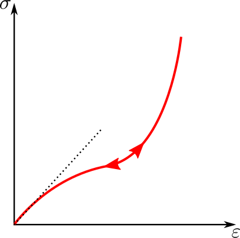

.. _sect-smm-cl:

Constitutive Laws
-----------------

In order to compute an element’s response to deformation, one needs to
use an appropriate constitutive relationship. The constitutive law is
used to compute the element’s stresses from the element’s strains.

In the finite-element discretization, the constitutive formulation is
applied to every quadrature point of each element. When the implicit
formulation is used, the tangent matrix has to be computed.

| The chosen materials for the simulation have to be specified in the
  mesh file or, as an alternative, they can be assigned using the at
  ``element_material`` vector. For
  every material assigned to the problem one has to specify the material
  characteristics (constitutive behavior and material properties) using
  the text input file (see :ref:`sect-io-material`).
| In order to conveniently store values at each quadrature in a material point
  ``Akantu`` provides a special data structure, the at :cpp:class:`InternalField
  <akantu::InternalField>`. The internal fields are inheriting from the at
  :cpp:class:`ElementTypeMapArray <akantu::ElementTypeMapArray>`. Furthermore,
  it provides several functions for initialization, auto-resizing and auto
  removal of quadrature points.

Sometimes it is also desired to generate random distributions of
internal parameters. An example might be the critical stress at which
the material fails. To generate such a field, in the text input file, a
random quantity needs be added to the base value:

All parameters are real numbers. For the uniform distribution, minimum
and maximum values have to be specified. Random parameters are defined
as a :math:`base` value to which we add a random number that follows the
chosen distribution.

The
`Uniform <http://en.wikipedia.org/wiki/Uniform_distribution_(continuous)>`__
distribution is gives a random values between in :math:`[min, max)`. The
`Weibull <http://en.wikipedia.org/wiki/Weibull_distribution>`__
distribution is characterized by the following cumulative distribution
function:

.. math:: F(x) = 1- e^{-\left({x/\lambda}\right)^m}

which depends on :math:`m` and :math:`\lambda`, which are the shape
parameter and the scale parameter. These random distributions are
different each time the code is executed. In order to obtain always the
same one, it possible to manually set the *seed* that is the number from
which these pseudo-random distributions are created. This can be done by
adding the following line to the input file *outside* the material
parameters environments:

.. code-block::

   seed = 1.0

where the value 1.0 can be substituted with any number. Currently
``Akantu`` can reproduce always the same distribution when the seed is
specified *only* in serial. The value of the *seed* can be also
specified directly in the code (for instance in the main file) with the
command:

.. code-block::

   RandGenerator<Real>::seed(1.0)

The same command, with empty brackets, can be used to check the value of
the *seed* used in the simulation.

The following sections describe the constitutive models implemented in
``Akantu``. In Appendix `7 <#app:material-parameters>`__ a summary of
the parameters for all materials of ``Akantu`` is provided.

Elastic
```````

The elastic law is a commonly used constitutive relationship that can be
used for a wide range of engineering materials (*e.g.*, metals,
concrete, rock, wood, glass, rubber, etc.) provided that the strains
remain small (*i.e.*, small deformation and stress lower than yield
strength).

The elastic laws are often expressed as
:math:`\boldsymbol{\sigma} =
\boldsymbol{C}:\boldsymbol{\varepsilon}` with
where :math:`\boldsymbol{\sigma}` is the Cauchy stress
tensor, :math:`\boldsymbol{\varepsilon}` represents the
infinitesimal strain tensor and :math:`\boldsymbol{C}` is
the elastic modulus tensor.

.. _sect-smm-linear-elastic-isotropic:

Linear isotropic
''''''''''''''''

The linear isotropic elastic behavior is described by Hooke’s law, which
states that the stress is linearly proportional to the applied strain
(material behaves like an ideal spring), as illustrated in
 :numref:`fig:smm:cl:el`.


   Stress-strain curve of elastic material and schematic representation of
   Hooke's law, denoted as a spring.

The equation that relates the strains to the displacements is: point)
from the displacements as follows:

.. math::

   \label{eqn:smm:strain_inf}
     \boldsymbol{\varepsilon} =
     \frac{1}{2} \left[ \nabla_0 \boldsymbol{u}+\nabla_0 \boldsymbol{u}^T \right]

where :math:`\boldsymbol{\varepsilon}` represents the
infinitesimal strain tensor,
:math:`\nabla_{0}\boldsymbol{u}` the displacement gradient
tensor according to the initial configuration. The constitutive equation
for isotropic homogeneous media can be expressed as:

.. math::

   \label{eqn:smm:material:constitutive_elastic}
     \boldsymbol{\sigma } =\lambda\mathrm{tr}(\boldsymbol{\varepsilon})\boldsymbol{I}+2 \mu\boldsymbol{\varepsilon}

where :math:`\boldsymbol{\sigma}` is the Cauchy stress
tensor (:math:`\lambda` and :math:`\mu` are the the first and second
Lame’s coefficients).

In Voigt notation this correspond to

.. math::

   \begin{aligned}
     \left[\begin{array}{c}
         \sigma_{11}\\
         \sigma_{22}\\
         \sigma_{33}\\
         \sigma_{23}\\
         \sigma_{13}\\
         \sigma_{12}\\
       \end{array}\right]
     &= \frac{E}{(1+\nu)(1-2\nu)}\left[
       \begin{array}{cccccc}
         1-\nu & \nu   & \nu   & 0 & 0 & 0\\
         \nu   & 1-\nu & \nu   & 0 & 0 & 0\\
         \nu   & \nu   & 1-\nu & 0 & 0 & 0\\
         0     &  0    &  0    & \frac{1-2\nu}{2} & 0 & 0 \\
         0     &  0    &  0    & 0 & \frac{1-2\nu}{2} & 0 \\
         0     &  0    &  0    & 0 & 0 & \frac{1-2\nu}{2} \\
       \end{array}\right]
     \left[\begin{array}{c}
         \varepsilon_{11}\\
         \varepsilon_{22}\\
         \varepsilon_{33}\\
         2\varepsilon_{23}\\
         2\varepsilon_{13}\\
         2\varepsilon_{12}\\
       \end{array}\right]\end{aligned}

.. _sect-smm-linear-elastic-anisotropic:

Linear anisotropic
''''''''''''''''''

This formulation is not sufficient to represent all elastic material
behavior. Some materials have characteristic orientation that have to be
taken into account. To represent this anisotropy a more general
stress-strain law has to be used. For this we define the elastic modulus
tensor as follow:

.. math::

   \begin{aligned}
     \left[\begin{array}{c}
         \sigma_{11}\\
         \sigma_{22}\\
         \sigma_{33}\\
         \sigma_{23}\\
         \sigma_{13}\\
         \sigma_{12}\\
       \end{array}\right]
     &= \left[
       \begin{array}{cccccc}
         c_{11} & c_{12} & c_{13} & c_{14} & c_{15} & c_{16}\\
         c_{21} & c_{22} & c_{23} & c_{24} & c_{25} & c_{26}\\
         c_{31} & c_{32} & c_{33} & c_{34} & c_{35} & c_{36}\\
         c_{41} & c_{42} & c_{43} & c_{44} & c_{45} & c_{46}\\
         c_{51} & c_{52} & c_{53} & c_{54} & c_{55} & c_{56}\\
         c_{61} & c_{62} & c_{63} & c_{64} & c_{65} & c_{66}\\
       \end{array}\right]
     \left[\begin{array}{c}
         \varepsilon_{11}\\
         \varepsilon_{22}\\
         \varepsilon_{33}\\
         2\varepsilon_{23}\\
         2\varepsilon_{13}\\
         2\varepsilon_{12}\\
       \end{array}\right]\end{aligned}

To simplify the writing of input files the :math:`\boldsymbol{C}` tensor
is expressed in the material basis. And this basis as to be given too.
This basis :math:`\Omega_{{\mathrm{mat}}}
= \{\boldsymbol{n_1}, \boldsymbol{n_2}, \boldsymbol{n_3}\}`
is used to define the rotation :math:`R_{ij} =
\boldsymbol{n_j} . \boldsymbol{e_i}`. And
:math:`\boldsymbol{C}` can be rotated in the global basis
:math:`\Omega
= \{\boldsymbol{e_1}, \boldsymbol{e_2}, \boldsymbol{e_3}\}`
as follow:

.. math::

   \begin{aligned}
   \boldsymbol{C}_{\Omega} &= \boldsymbol{R}_1 \boldsymbol{C}_{\Omega_{{\mathrm{mat}}}} \boldsymbol{R}_2\\
   \boldsymbol{R}_1  &= \left[
     \begin{array}{cccccc}
       R_{11} R_{11} & R_{12} R_{12} & R_{13} R_{13} & R_{12} R_{13} & R_{11} R_{13} & R_{11} R_{12}\\
       R_{21} R_{21} & R_{22} R_{22} & R_{23} R_{23} & R_{22} R_{23} & R_{21} R_{23} & R_{21} R_{22}\\
       R_{31} R_{31} & R_{32} R_{32} & R_{33} R_{33} & R_{32} R_{33} & R_{31} R_{33} & R_{31} R_{32}\\
       R_{21} R_{31} & R_{22} R_{32} & R_{23} R_{33} & R_{22} R_{33} & R_{21} R_{33} & R_{21} R_{32}\\
       R_{11} R_{31} & R_{12} R_{32} & R_{13} R_{33} & R_{12} R_{33} & R_{11} R_{33} & R_{11} R_{32}\\
       R_{11} R_{21} & R_{12} R_{22} & R_{13} R_{23} & R_{12} R_{23} & R_{11} R_{23} & R_{11} R_{22}\\
     \end{array}\right]\\
   \boldsymbol{R}_2  &= \left[
     \begin{array}{cccccc}
       R_{11} R_{11} & R_{21} R_{21} & R_{31} R_{31} & R_{21} R_{31} & R_{11} R_{31} & R_{11} R_{21}\\
       R_{12} R_{12} & R_{22} R_{22} & R_{32} R_{32} & R_{22} R_{32} & R_{12} R_{32} & R_{12} R_{22}\\
       R_{13} R_{13} & R_{23} R_{23} & R_{33} R_{33} & R_{23} R_{33} & R_{13} R_{33} & R_{13} R_{23}\\
       R_{12} R_{13} & R_{22} R_{23} & R_{32} R_{33} & R_{22} R_{33} & R_{12} R_{33} & R_{12} R_{23}\\
       R_{11} R_{13} & R_{21} R_{23} & R_{31} R_{33} & R_{21} R_{33} & R_{11} R_{33} & R_{11} R_{23}\\
       R_{11} R_{12} & R_{21} R_{22} & R_{31} R_{32} & R_{21} R_{32} & R_{11} R_{32} & R_{11} R_{22}\\
     \end{array}\right]\\\end{aligned}

.. _sect-smm-linear-elastic-orthotropic:

Linear orthotropic
''''''''''''''''''

A particular case of anisotropy is when the material basis is orthogonal
in which case the elastic modulus tensor can be simplified and rewritten
in terms of 9 independents material parameters.

.. math::

   \begin{aligned}
     \left[\begin{array}{c}
         \sigma_{11}\\
         \sigma_{22}\\
         \sigma_{33}\\
         \sigma_{23}\\
         \sigma_{13}\\
         \sigma_{12}\\
       \end{array}\right]
     &= \left[
       \begin{array}{cccccc}
         c_{11} & c_{12} & c_{13} &   0   &   0   &   0  \\
               & c_{22} & c_{23} &   0   &   0   &   0  \\
               &       & c_{33} &   0   &   0   &   0  \\
               &       &       & c_{44} &   0   &   0  \\
               &  \multicolumn{2}{l}{\text{sym.}}       &       & c_{55} &   0  \\
               &       &       &       &       & c_{66}\\
       \end{array}\right]
     \left[\begin{array}{c}
         \varepsilon_{11}\\
         \varepsilon_{22}\\
         \varepsilon_{33}\\
         2\varepsilon_{23}\\
         2\varepsilon_{13}\\
         2\varepsilon_{12}\\
       \end{array}\right]\end{aligned}

.. math::

   \begin{aligned}
     c_{11} &= E_1 (1 - \nu_{23}\nu_{32})\Gamma \qquad c_{22} = E_2 (1 - \nu_{13}\nu_{31})\Gamma \qquad c_{33} = E_3 (1 - \nu_{12}\nu_{21})\Gamma\\
     c_{12} &= E_1 (\nu_{21} - \nu_{31}\nu_{23})\Gamma = E_2 (\nu_{12} - \nu_{32}\nu_{13})\Gamma\\
     c_{13} &= E_1 (\nu_{31} - \nu_{21}\nu_{32})\Gamma = E_2 (\nu_{13} - \nu_{21}\nu_{23})\Gamma\\
     c_{23} &= E_2 (\nu_{32} - \nu_{12}\nu_{31})\Gamma = E_3 (\nu_{23} - \nu_{21}\nu_{13})\Gamma\\
     c_{44} &= \mu_{23} \qquad  c_{55} = \mu_{13} \qquad  c_{66} = \mu_{12} \\
     \Gamma &= \frac{1}{1 - \nu_{12} \nu_{21} - \nu_{13} \nu_{31} - \nu_{32} \nu_{23} - 2 \nu_{21} \nu_{32} \nu_{13}}\end{aligned}

The Poisson ratios follow the rule
:math:`\nu_{ij} = \nu_{ji} E_i / E_j`.

.. _sect-smm-cl-neohookean:

Neo-Hookean
'''''''''''

The hyperelastic Neo-Hookean constitutive law results from an extension
of the linear elastic relationship (Hooke’s Law) for large deformation.
Thus, the model predicts nonlinear stress-strain behavior for bodies
undergoing large deformations.



   Neo-hookean Stress-strain curve.

As illustrated in :numref:`fig:smm:cl:neo_hookean`, the behavior
is initially linear and the mechanical behavior is very close to the
corresponding linear elastic material. This constitutive relationship,
which accounts for compressibility, is a modified version of the one
proposed by Ronald Rivlin :cite:`Belytschko:2000`.

The strain energy stored in the material is given by:

.. math::

   \label{eqn:smm:constitutive:neohookean_potential}
     \Psi(\boldsymbol{C}) = \frac{1}{2}\lambda_0\left(\ln J\right)^2-\mu_0\ln J+\frac{1}{2}
     \mu_0\left(\mathrm{tr}(\boldsymbol{C})-3\right)

where :math:`\lambda_0` and :math:`\mu_0` are, respectively, Lamé’s
first parameter and the shear modulus at the initial configuration.
:math:`J` is the jacobian of the deformation gradient
(:math:`\boldsymbol{F}=\nabla_{\!\!\boldsymbol{X}}\boldsymbol{x}`):
:math:`J=\text{det}(\boldsymbol{F})`. Finally
:math:`\boldsymbol{C}` is the right Cauchy-Green
deformation tensor.

Since this kind of material is used for large deformation problems, a
finite deformation framework should be used. Therefore, the Cauchy
stress (:math:`\boldsymbol{\sigma}`) should be computed
through the second Piola-Kirchhoff stress tensor
:math:`\boldsymbol{S}`:

.. math:: \boldsymbol{\sigma } = \frac{1}{J}\boldsymbol{F}\boldsymbol{S}\boldsymbol{F}^T

Finally the second Piola-Kirchhoff stress tensor is given by:

.. math::

   \boldsymbol{S}  = 2\frac{\partial\Psi}{\partial\boldsymbol{C}} = \lambda_0\ln J
     \boldsymbol{C}^{-1}+\mu_0\left(\boldsymbol{I}-\boldsymbol{C}^{-1}\right)

The parameters to indicate in the material file are the same as those
for the elastic case: ``E`` (Young’s modulus), ``nu`` (Poisson’s ratio).

.. _sect-smm-cl-sls:

Visco-Elasticity
''''''''''''''''

Visco-elasticity is characterized by strain rate dependent behavior.
Moreover, when such a material undergoes a deformation it dissipates
energy. This dissipation results in a hysteresis loop in the
stress-strain curve at every loading cycle (see
:numref:`fig:smm:cl:visco-elastic:hyst`).
In principle, it can be applied to many materials, since all materials
exhibit a visco-elastic behavior if subjected to particular conditions
(such as high temperatures).


   Characteristic stress-strain behavior of a visco-elastic material with hysteresis loop

.. figure:: figures/cl/visco_elastic_law.svg
   :name:   fig:smm:cl:visco-elastic:model
   :align: center
   :width: 40.0%

   Schematic representation of the standard rheological linear solid visco-elastic model

The standard rheological linear solid model (see Sections 10.2 and 10.3
of :cite:`simo92`) has been implemented in ``Akantu``. This
model results from the combination of a spring mounted in parallel with
a spring and a dashpot connected in series, as illustrated in
:numref:`fig:smm:cl:visco-elastic:model`.
The advantage of this model is that it allows to account for creep or
stress relaxation. The equation that relates the stress to the strain is
(in 1D):

.. math:: \frac{d\varepsilon(t)}{dt} = \left ( E + E_V \right ) ^ {-1} \cdot \left [ \frac{d\sigma(t)}{dt} + \frac{E_V}{\eta}\sigma(t) - \frac{EE_V}{\eta}\varepsilon(t) \right ]

where :math:`\eta` is the viscosity. The equilibrium condition is unique and is
attained in the limit, as :math:`t \to \infty`. At this stage, the response is
elastic and depends on the Young’s modulus :math:`E`. The mandatory parameters
for the material file are the following: ``rho`` (density), ``E`` (Young’s
modulus), ``nu`` (Poisson’s ratio), ``Plane_Stress`` (if set to zero plane
strain, otherwise plane stress), ``eta`` (dashpot viscosity) and ``Ev``
(stiffness of the viscous element).

Note that the current standard linear solid model is applied only on the
deviatoric part of the strain tensor. The spheric part of the strain
tensor affects the stress tensor like an linear elastic material.

.. _sect-smm-cl-plastic:

Plastic
```````

Small-Deformation Plasticity
''''''''''''''''''''''''''''

The small-deformation plasticity is a simple plasticity material
formulation which accounts for the additive decomposition of strain into
elastic and plastic strain components. This formulation is applicable to
infinitesimal deformation where the additive decomposition of the strain
is a valid approximation. In this formulation, plastic strain is a
shearing process where hydrostatic stress has no contribution to
plasticity and consequently plasticity does not lead to volume change.
:numref:`fig:smm:cl:Lin-strain-hard` shows the linear strain
hardening elasto-plastic behavior according to the additive
decomposition of strain into the elastic and plastic parts in
infinitesimal deformation as

.. math::

   \boldsymbol{\varepsilon} &= \boldsymbol{\varepsilon}^e +\boldsymbol{\varepsilon}^p\\
   \boldsymbol{\sigma} &= 2G(\boldsymbol{\varepsilon}^e) + \lambda  \mathrm{tr}(\boldsymbol{\varepsilon}^e)\boldsymbol{I}

.. figure:: figures/cl/isotropic_hardening_plasticity.svg
   :name:   fig:smm:cl:Lin-strain-hard
   :align: center

   Stress-strain curve for the small-deformation plasticity with linear isotropic hardening.

In this class, the von Mises yield criterion is used. In the von Mises
yield criterion, the yield is independent of the hydrostatic stress.
Other yielding criteria such as Tresca and Gurson can be easily
implemented in this class as well.

In the von Mises yield criterion, the hydrostatic stresses have no
effect on the plasticity and consequently the yielding occurs when a
critical elastic shear energy is achieved.

.. math::

   \label{eqn:smm:constitutive:von Mises}
     f = \sigma_{{\mathrm{eff}}} - \sigma_y = \left(\frac{3}{2} {\boldsymbol{\sigma}}^{{\mathrm{tr}}} : {\boldsymbol{\sigma}}^{{\mathrm{tr}}}\right)^\frac{1}{2}-\sigma_y (\boldsymbol{\varepsilon}^p)

.. math::

   \label{eqn:smm:constitutive:yielding}
     f < 0 \quad \textrm{Elastic deformation,} \qquad f = 0 \quad  \textrm{Plastic deformation}

where :math:`\sigma_y` is the yield strength of the material which can
be function of plastic strain in case of hardening type of materials and
:math:`{\boldsymbol{\sigma}}^{{\mathrm{tr}}}` is the
deviatoric part of stress given by

.. math::

   \label{eqn:smm:constitutive:deviatoric stress}
     {\boldsymbol{\sigma}}^{{\mathrm{tr}}}=\boldsymbol{\sigma} - \frac{1}{3} \mathrm{tr}(\boldsymbol{\sigma}) \boldsymbol{I}

After yielding :math:`(f = 0)`, the normality hypothesis of plasticity
determines the direction of plastic flow which is normal to the tangent
to the yielding surface at the load point. Then, the tensorial form of
the plastic constitutive equation using the von Mises yielding criterion
(see equation 4.34) may be written as

.. math::

   \label{eqn:smm:constitutive:plastic contitutive equation}
     \Delta {\boldsymbol{\varepsilon}}^p = \Delta p \frac {\partial{f}}{\partial{\boldsymbol{\sigma}}}=\frac{3}{2} \Delta p \frac{{\boldsymbol{\sigma}}^{{\mathrm{tr}}}}{\sigma_{{\mathrm{eff}}}}

In these expressions, the direction of the plastic strain increment (or
equivalently, plastic strain rate) is given by
:math:`\frac{{\boldsymbol{\sigma}}^{{\mathrm{tr}}}}{\sigma_{{\mathrm{eff}}}}`
while the magnitude is defined by the plastic multiplier
:math:`\Delta p`. This can be obtained using the *consistency condition*
which impose the requirement for the load point to remain on the
yielding surface in the plastic regime.

Here, we summarize the implementation procedures for the
small-deformation plasticity with linear isotropic hardening:

#. Compute the trial stress:

   .. math:: {\boldsymbol{\sigma}}^{{\mathrm{tr}}} = {\boldsymbol{\sigma}}_t + 2G\Delta \boldsymbol{\varepsilon} + \lambda \mathrm{tr}(\Delta \boldsymbol{\varepsilon})\boldsymbol{I}

#. Check the Yielding criteria:

   .. math:: f = (\frac{3}{2} {\boldsymbol{\sigma}}^{{\mathrm{tr}}} : {\boldsymbol{\sigma}}^{{\mathrm{tr}}})^{1/2}-\sigma_y (\boldsymbol{\varepsilon}^p)

#. Compute the Plastic multiplier:

   .. math::

      \begin{aligned}
          d \Delta p &= \frac{\sigma^{tr}_{eff} - 3G \Delta P^{(k)}- \sigma_y^{(k)}}{3G + h}\\
          \Delta p^{(k+1)} &= \Delta p^{(k)}+ d\Delta p\\
          \sigma_y^{(k+1)} &= (\sigma_y)_t+ h\Delta p
        \end{aligned}

#. Compute the plastic strain increment:

   .. math:: \Delta {\boldsymbol{\varepsilon}}^p = \frac{3}{2} \Delta p \frac{{\boldsymbol{\sigma}}^{{\mathrm{tr}}}}{\sigma_{{\mathrm{eff}}}}

#. Compute the stress increment:

   .. math:: {\Delta \boldsymbol{\sigma}} = 2G(\Delta \boldsymbol{\varepsilon}-\Delta \boldsymbol{\varepsilon}^p) + \lambda  \mathrm{tr}(\Delta \boldsymbol{\varepsilon}-\Delta \boldsymbol{\varepsilon}^p)\boldsymbol{I}

#. Update the variables:

   .. math::

      \begin{aligned}
          {\boldsymbol{\varepsilon^p}} &= {\boldsymbol{\varepsilon}}^p_t+{\Delta {\boldsymbol{\varepsilon}}^p}\\
          {\boldsymbol{\sigma}} &= {\boldsymbol{\sigma}}_t+{\Delta \boldsymbol{\sigma}}
        \end{aligned}

We use an implicit integration technique called *the radial return method* to
obtain the plastic multiplier. This method has the advantage of being
unconditionally stable, however, the accuracy remains dependent on the step
size. The plastic parameters to indicate in the material file are:
:math:`\sigma_y` (Yield stress) and ``h`` (Hardening modulus). In addition, the
elastic parameters need to be defined as previously mentioned: ``E`` (Young’s
modulus), ``nu`` (Poisson’s ratio).

Damage
``````

In the simplified case of a linear elastic and brittle material,
isotropic damage can be represented by a scalar variable :math:`d`,
which varies from :math:`0` to :math:`1` for no damage to fully broken
material respectively. The stress-strain relationship then becomes:

.. math:: \boldsymbol{\sigma} = (1-d)\, \boldsymbol{C}:\boldsymbol{\varepsilon}

where :math:`\boldsymbol{\sigma}`,
:math:`\boldsymbol{\varepsilon}` are the Cauchy stress and
strain tensors, and :math:`\boldsymbol{C}` is the elastic
stiffness tensor. This formulation relies on the definition of an
evolution law for the damage variable. In ``Akantu``, many possibilities
exist and they are listed below.

.. _sect-smm-cl-damage-marigo:

Marigo
''''''

This damage evolution law is energy based as defined by Marigo
:cite:`marigo81a`, :cite:`lemaitre96a`. It is an isotropic damage law.

.. math::

   \begin{aligned}
     Y &= \frac{1}{2}\boldsymbol{\varepsilon}:\boldsymbol{C}:\boldsymbol{\varepsilon}\\
     F &= Y - Y_d - S d\\
     d &= \left\{
       \begin{array}{l l}
         \mathrm{min}\left(\frac{Y-Y_d}{S},\;1\right) & \mathrm{if}\; F > 0\\
         \mathrm{unchanged} & \mathrm{otherwise}
       \end{array}
     \right.\end{aligned}

In this formulation, :math:`Y` is the strain energy release rate,
:math:`Y_d` the rupture criterion and :math:`S` the damage energy. The
non-local version of this damage evolution law is constructed by
averaging the energy :math:`Y`.

.. _sect-smm-cl-damage-mazars:

Mazars
''''''

This law introduced by Mazars :cite:`mazars84a` is a
behavioral model to represent damage evolution in concrete. This model
does not rely on the computation of the tangent stiffness, the damage is
directly evaluated from the strain.

The governing variable in this damage law is the equivalent strain
:math:`\varepsilon_{{\mathrm{eq}}} =
\sqrt{<\boldsymbol{\varepsilon}>_+:<\boldsymbol{\varepsilon}>_+}`,
with :math:`<.>_+` the positive part of the tensor. This part is defined
in the principal coordinates (I, II, III) as
:math:`\varepsilon_{{\mathrm{eq}}} =
\sqrt{<\boldsymbol{\varepsilon_I}>_+^2 + <\boldsymbol{\varepsilon_{II}}>_+^2 + <\boldsymbol{\varepsilon_{III}}>_+^2}`.
The damage is defined as:

.. math::

   \begin{aligned}
     D &= \alpha_t^\beta D_t + (1-\alpha_t)^\beta D_c\\
     D_t &= 1 - \frac{\kappa_0 (1- A_t)}{\varepsilon_{{\mathrm{eq}}}} - A_t \exp^{-B_t(\varepsilon_{{\mathrm{eq}}}-\kappa_0)}\\
     D_c &= 1 - \frac{\kappa_0 (1- A_c)}{\varepsilon_{{\mathrm{eq}}}} - A_c
     \exp^{-B_c(\varepsilon_{{\mathrm{eq}}}-\kappa_0)}\\
     \alpha_t &= \frac{\sum_{i=1}^3<\varepsilon_i>_+\varepsilon_{{\mathrm{nd}}\;i}}{\varepsilon_{{\mathrm{eq}}}^2}\end{aligned}

With :math:`\kappa_0` the damage threshold, :math:`A_t` and :math:`B_t`
the damage parameter in traction, :math:`A_c` and :math:`B_c` the damage
parameter in compression, :math:`\beta` is the shear parameter.
:math:`\alpha_t` is the coupling parameter between traction and
compression, the :math:`\varepsilon_i` are the eigenstrain and the
:math:`\varepsilon_{{\mathrm{nd}}\;i}` are the eigenvalues of the strain
if the material were undamaged.

The coefficients :math:`A` and :math:`B` are the post-peak asymptotic
value and the decay shape parameters.

.. _sect:smm:CLNL:

Non-Local Constitutive Laws
```````````````````````````

Continuum damage modeling of quasi-brittle materials undergo significant
softening after the onset of damage. This fast growth of damage causes a loss of
ellipticity of partial differential equations of equilibrium. Therefore, the
numerical simulation results won't be objective anymore, because the dissipated
energy will depend on mesh size used in the simulation. One way to avoid this
effect is the use of non-local damage formulations. In this approach a local
quantity such as the strain is replaced by its non-local average, where the size
of the domain, over which the quantitiy is averaged, depends on the underlying
material microstructure. ``Akantu`` provides non-local versions of many
constitutive laws for damage. Examples are for instance the material
:ref:`sect-smm-cl-damage-mazars` and the material
:ref:`sect-smm-cl-damage-marigo`, that can be used in a non-local context. In
order to use the corresponding non-local formulation the user has to define the
non-local material he wishes to use in the text input file:

.. code-block:: none

   material constitutive_law_non_local [
       name = material_name
       rho = $value$
       ...
   ]

where ``constitutive_law_non_local`` is the name of the non-local constitutive law, *e.g.* `marigo_non_local`.
In addition to the material the non-local neighborhood, that should be used for the averaging process needs to be defined in the material file as well:

.. code-block:: none

  non_local neighborhood_name weight_function_type [
     radius = $value$
     ...
      weight_function weight_parameter [
        damage_limit = $value$
        ...
     ]
  ]

for the non-local averaging, *e.g.* ``base_wf``, followed by the properties of the non-local neighborhood, such as the radius, and the weight function parameters. It is important to notice that the non-local neighborhood must have the same name as the material to which the neighborhood belongs!
The following two sections list the non-local constitutive laws and different type of weight functions available in ``Akantu``.
\subsection{Non-local constitutive laws}
Let us consider a body having a volume :math:`V` and a boundary :math:`\Gamma`. The stress-strain relation for a non-local damage model can be described as follows:

.. _eq:non-local-const:
 .. math:: \vec{\sigma} = (1-\bar{d}) \vec{D}:\epsilon

with :math:`\vec{D}` the elastic moduli tensor, :math:`\sigma` the stress tensor, :math:`\epsilon` the strain tensor and :math:`\bar{d}` the non-local damage variable. Note that this stres-strain relationship is similar to the relationship defined in Damage model except :math:`\bar{d}`. The non-local damage model can be extended to the damage constitutive laws: :ref:`sect-smm-cl-damage-marigo` and :ref:`sect-smm-cl-damage-mazars`.

The non-local damage variable :math:`\bar{d}` is defined as follows:

.. _eq:non-local-const:
 .. math:: \bar{d}(\vec{x}) = \int_{V}W(\vec{x}, \vec{y}) d(\vec{y}) dV(\vec{y})

with :math:`W(\vec{x},\vec{y})` the weight function which averages local damage variables to describe the non-local interactions. A list of available weight functions and its functionalities in \akantu are explained in the next section.

Non-local weight functions
''''''''''''''''''''''''''

The available weight functions in ``Akantu`` are follows:

 - ``base_weight_function``: This weight function averages local damage variables by using a bell-shape function on spatial dimensions.
 -  ``damaged_weight_function``: A linear-shape weight function is applied to average local damage variables. Its slope is determined by damage variables. For example, the damage variables for an element which is highly damaged are averaged over  large spatial dimension (linear function including a small slope).
 - ``remove_damaged_weight_function``: This weight function averages damage values by using a bell-shape function as  ``base_weight_function``, but excludes elements which are fully damaged.
 - ``remove_damaged_with_damage_rate_weight_function``: A bell-shape function is applied to average local damage variables for elements having small damage rates.
 - ``stress_based_weight_function``: Non local integral takes stress states, and use the states to construct weight function: an ellipsoid shape. Detailed explanations of this weight function are given in Giry et al. :cite:`giry13a`.


.. _sec-cohesive-laws:

Cohesive Constitutive laws
``````````````````````````

.. _ssect-smm-cl-coh-snozzi:

Linear Irreversible Law
'''''''''''''''''''''''


   Irreversible cohesive laws for explicit simulations.


`Akantu` includes the Snozzi-Molinari :cite:`snozzi_cohesive_2013`
linear irreversible cohesive law (see
:numref:`fig:smm:coh:linear_cohesive_law`). It is an extension to
the Camacho-Ortiz :cite:`camacho_computational_1996` cohesive law in
order to make dissipated fracture energy path-dependent. The concept
of free potential energy is dropped and a new independent parameter
:math:`\kappa` is introduced:

.. math::
  \kappa = \frac{G_\mathrm{c, II}}{G_\mathrm{c, I}}


where :math:`G_\mathrm{c, I}` and :math:`G_\mathrm{c, II}` are the
necessary works of separation per unit area to open completely a
cohesive zone under mode I and mode II, respectively. Their model yields to the
following equation for cohesive tractions :math:`\vec{T}` in case of crack
opening :math:`{\delta}`:

.. math::
  \vec{T} = \left( \frac{\beta^2}{\kappa} \Delta_\mathrm{t} \vec{t} +
    \Delta_\mathrm{n} \vec{n} \right)
  \frac{\sigma_\mathrm{c}}{\delta}
  \left( 1- \frac{\delta}{\delta_\mathrm{c}} \right)
  = \hat{\vec T}\,
  \frac{\sigma_\mathrm{c}}{\delta}
  \left( 1- \frac{\delta}{\delta_\mathrm{c}} \right)
  :label: eq-smm-coh-tractions

where :math:`\sigma_\mathrm{c}` is the material strength along the fracture,
:math:`\delta_\mathrm{c}` the critical effective displacement after which
cohesive tractions are zero (complete decohesion), :math:`\Delta_\mathrm{t}`
and :math:`\Delta_\mathrm{n}` are the tangential and normal components of
the opening displacement vector :math:`\vec{\Delta}`, respectively. The
parameter :math:`\beta` is a weight that indicates how big the tangential
opening contribution is. The effective opening displacement is:

.. math::
   \delta = \sqrt{\frac{\beta^2}{\kappa^2} \Delta_\mathrm{t}^2 + \Delta_\mathrm{n}^2}

In case of unloading or reloading :math:`\delta < \delta_\mathrm{max}`,
tractions are calculated as:

.. math::
   \begin{eqnarray}
   T_\mathrm{n} &= \Delta_\mathrm{n}\, \frac{\sigma_\mathrm{c}}{\delta_\mathrm{max}} \left( 1- \frac{\delta_\mathrm{max}}{\delta_\mathrm{c}} \right) \\
  T_\mathrm{t} &= \frac{\beta^2}{\kappa}\, \Delta_\mathrm{t}\, \frac{\sigma_\mathrm{c}}{\delta_\mathrm{max}} \left( 1- \frac{\delta_\mathrm{max}}{\delta_\mathrm{c}} \right)
   \end{eqnarray}

so that they vary linearly between the origin and the maximum attained
tractions. As shown in :numref:`fig:smm:coh:linear_cohesive_law`,
in this law, the dissipated and reversible energies are:

.. math::
   \begin{eqnarray}
   E_\mathrm{diss} &= \frac{1}{2} \sigma_\mathrm{c}\, \delta_\mathrm{max}\\[1ex]
   E_\mathrm{rev} &= \frac{1}{2} T\, \delta
   \end{eqnarray}

Moreover, a damage parameter :math:`D` can be defined as:

.. math::
  D = \min \left(
    \frac{\delta_\mathrm{max}}{\delta_\mathrm{c}},1 \right)

which varies from 0 (undamaged condition) and 1 (fully
damaged condition). This variable can only increase because damage is
an irreversible process. A simple penalty contact model has been incorporated
in the cohesive law so that normal tractions can be returned in
case of compression:

.. math::
  T_\mathrm{n} = \alpha \Delta_\mathrm{n} \quad\text{if}\quad
  \Delta_\mathrm{n}\quad <\quad 0

where :math:`\alpha` is a stiffness parameter that defaults to zero. The
relative contact energy is equivalent to reversible energy but in
compression.

The material name of the linear decreasing cohesive law is
``material_cohesive_linear`` and its parameters with their respective default
values are:

- ``sigma_c = 0``
- ``delta_c = 0``
- ``beta = 0``
- ``G_c = 0``
- ``kappa = 1``
- ``penalty = 0``

where ``G_c`` corresponds to :math:`G_\mathrm{c, I}`. A random number
generator can be used to assign a random :math:`\sigma_\mathrm{c}` to each
facet following a given distribution (see
Section :ref:`sect-smm-cl`). Only one parameter between ``delta_c``
and ``G_c`` has to be specified. For random :math:`\sigma_\mathrm{c}`
distributions, the chosen parameter of these two is kept fixed and the
other one is varied.

The bi-linear constitutive law works exactly the same way as the linear
one, except for the additional parameter ``delta_0`` that by
default is zero. Two examples for the extrinsic and intrinsic cohesive
elements and also an example to assign different properties to
inter-granular and trans-granular cohesive elements can be found in
the folder ``examples/cohesive_element/``.

.. _ssect:smm:cl:coh-friction:

Linear Cohesive Law with Friction
'''''''''''''''''''''''''''''''''

This law represents a variation of the linear irreversible cohesive of
the previous section, which adds friction.  The friction behavior is
approximated with an elasto-plastic law, which relates the friction
force to the relative sliding between the two faces of the cohesive
element.  The slope of the elastic branch is called
``penalty_for_friction``, and is defined by the user, together
with the friction coefficient, as a material property.  The friction
contribution evolves with the damage of the cohesive law: it is null
when the damage is zero, and it becomes maximum when the damage is
equal to one.  This is done by defining a current value of the
friction coefficient (mu) that increases linearly with the damage, up
to the value of the friction coefficient defined by the user.  The
yielding plateau of the friction law is given by the product of the
current friction coefficient and the local compression stress acting
in the cohesive element.  Such an approach is equivalent to a
node-to-node contact friction. Its accuracy is acceptable only for
small displacements.

The material name of the linear cohesive law with friction is
``material_cohesive_linear_friction``. Its additional parameters
with respect to those of the linear cohesive law without friction,
with the respective default values, are:

- ``mu = 0``
- ``penalty_for_friction = 0``

.. _ssect:smm:cl:coh-fatigue:

Linear Cohesive Law with Fatigue
''''''''''''''''''''''''''''''''

This law represents a variation of the linear irreversible cohesive
law of the previous section, that removes the hypothesis of elastic
unloading-reloading cycles. With this law, some energy is dissipated
also during unloading and reloading with hysteresis. The
implementation follows the work of :cite:`nguyen2001`. During the
unloading-reloading cycle, the traction increment is computed as

.. math::
  \dot{T} =
  \begin{cases}
    K^- \, \dot{\delta} & \text{if $\dot{\delta} < 0$} \\
    K^+ \, \dot{\delta} & \text{if $\dot{\delta} > 0$} \\
  \end{cases}

where :math:`\dot{\delta}` and :math:`\dot{T}` are respectively the effective
opening displacement and the cohesive traction increments with respect
to time, while :math:`K^-` and :math:`K^+` are respectively the unloading and
reloading incremental stiffness. The unloading path is linear and
results in an unloading stiffness

.. math::
  K^- = \frac{T_\mathrm{max}}{\delta_\mathrm{max}}

where :math:`T_\mathrm{max}` and :math:`\delta_\mathrm{max}` are the maximum
cohesive traction and the effective opening displacement reached
during the precedent loading phase. The unloading stiffness remains
constant during the unloading phase. On the other hand the reloading
stiffness increment :math:`\dot{K}^+` is calculated as

.. math::
  \dot{K}^+ =
  \begin{cases}
    - K^+ \, \dot{\delta} / \delta_\mathrm{f} & \text{if $\dot{\delta}
      > 0$} \\
    \left( K^+ - K^- \right) \, \dot{\delta} / \delta_\mathrm{f} &
    \text{if $\dot{\delta}$ < $0$}
  \end{cases}

where :math:`\delta_\mathrm{f}` is a material parameter (refer
to :cite:`vocialta15` for more details). During unloading the stiffness
:math:`K^+` tends to :math:`K^-`, while during reloading :math:`K^+` gets decreased at
every time step. If the cohesive traction during reloading exceeds the
upper limit given by equation :eq:`eq-smm-coh-tractions`, it is
recomputed following the behavior of the linear decreasing cohesive
law for crack opening.

.. _ssect:smm:cl:coh-exponential:

Exponential Cohesive Law
'''''''''''''''''''''''''

Ortiz and Pandolfi proposed this cohesive law in 1999 :cite:`ortiz1999`.  The
traction-opening equation for this law is as follows:

.. math::
   T = e \sigma_c \frac{\delta}{\delta_c}e^{-\delta/ \delta_c}
   :label: eq:exponential_law

This equation is plotted in :numref:`fig:smm:cl:ecl`. The term
:math:`\partial{\vec{T}}/ \partial{\delta}` after the necessary derivation
can expressed as

.. math::
   \frac{\partial{\vec{T}}} {\partial{\delta}} = \hat{\vec{T}} \otimes
   \frac                       {\partial{(T/\delta)}}{\partial{\delta}}
   \frac{\hat{\vec{T}}}{\delta}+ \frac{T}{\delta}  \left[ \beta^2 \mat{I} +
   \left(1-\beta^2\right) \left(\vec{n} \otimes \vec{n}\right)\right]
   :label: eq:tangent_cohesive

where

.. math::
  \frac{\partial{(T/ \delta)}}{\partial{\delta}} = \left\{\begin{array} {l l}
      -e  \frac{\sigma_c}{\delta_c^2  }e^{-\delta  /  \delta_c} &  \quad  \text{if}
      \delta \geq \delta_{max}\\
      0 & \quad \text{if} \delta < \delta_{max}, \delta_n > 0
    \end{array} \right.


As regards the behavior in compression, two options are available:
a contact penalty approach with stiffness following the formulation of
the exponential law and a contact penalty approach with constant
stiffness. In the second case, the stiffness is defined as a function
of the tangent of the exponential law at the origin.


   Exponential cohesive law
