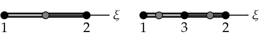
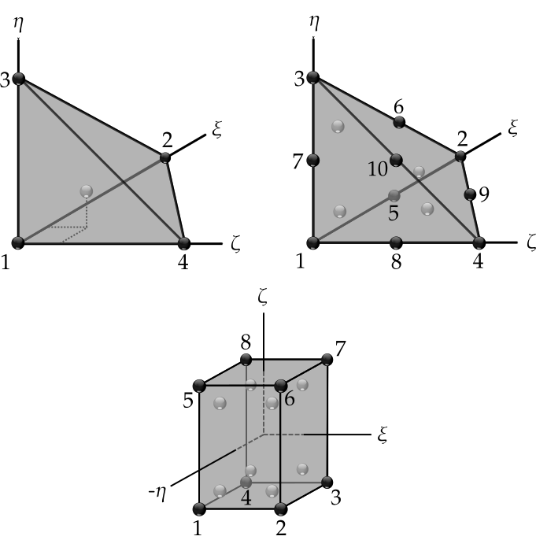
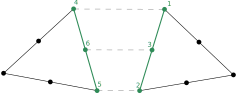
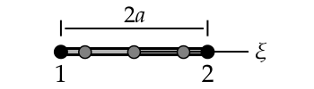

FEEngine
========

The :cpp:class:`FEEngine<akantu::FEEngine>` interface is dedicated to handle the
finite-element approximations and the numerical integration of the weak form. As
we will see in Chapter :doc:`./solidmechanicsmodel`,
:cpp:class:`Model<akantu::Model>` creates its own
:cpp:class:`FEEngine<akantu::FEEngine>` object so the explicit creation of the
object is not required.

Mathematical Operations
-----------------------

Using the :cpp:class:`FEEngine<akantu::FEEngine>` object, one can compute a interpolation,
an integration or a gradient.A simple example is given below:

.. code-block:: c++

   // having a FEEngine object
   auto fem = std::make_unique<FEEngineTemplate<IntegratorGauss, ShapeLagrange>>(my_mesh, dim, "my_fem");
   // instead of this, a FEEngine object can be get using the model:
   // model.getFEEngine()

   // compute the gradient
   Array<Real> u;       // append the values you want
   Array<Real> nablauq; // gradient array to be computed
   // compute the gradient
   fem->gradientOnIntegrationPoints(const Array<Real> & u, Array<Real> & nablauq,
                const UInt nb_degree_of_freedom,
                ElementType type);

   // interpolate
   Array<Real> uq; // interpolated array to be computed
                   // compute the interpolation
   fem->interpolateOnIntegrationPoints(const Array<Real> & u, Array<Real> & uq,
                UInt nb_degree_of_freedom,
                ElementType type);

   // interpolated function can be integrated over the elements
   Array<Real> int_val_on_elem;
   // integrate
   fem->integrate(const Array<Real> & uq, Array<Real> & int_uq,
                UInt nb_degree_of_freedom, ElementType type);


Another example below shows how to integrate stress and strain fields over
elements assigned to a particular material:

.. code-block:: c++

   UInt sp_dim{3};                  // spatial dimension
   UInt m{1};                       // material index of interest
   const auto type{_tetrahedron_4}; // element type

   // get the stress and strain arrays associated to the material index m
   const auto & strain_vec = model.getMaterial(m).getGradU(type);
   const auto & stress_vec = model.getMaterial(m).getStress(type);

   // get the element filter for the material index
   const auto & elem_filter = model.getMaterial(m).getElementFilter(type);

   // initialize the integrated stress and strain arrays
   Array<Real> int_strain_vec(elem_filter.getSize(), sp_dim * sp_dim,
                "int_of_strain");
   Array<Real> int_stress_vec(elem_filter.getSize(), sp_dim * sp_dim,
                "int_of_stress");

   // integrate the fields
   model.getFEEngine().integrate(strain_vec, int_strain_vec, sp_dim * sp_dim, type,
                _not_ghost, elem_filter);
   model.getFEEngine().integrate(stress_vec, int_stress_vec, sp_dim * sp_dim, type,
                _not_ghost, elem_filter);


.. _sec-elements:

Elements
--------

The base for every Finite-Elements computation is its mesh and the elements that
are used within that mesh. The element types that can be used depend on the
mesh, but also on the dimensionality of the problem (1D, 2D or 3D). In
``Akantu``, several iso-parametric Lagrangian element types are supported (and
one serendipity element). Each of these types is discussed in some detail below,
starting with the 1D-elements all the way to the 3D-elements. More detailed
information (shape function, location of Gaussian quadrature points, and so on)
can be found in Appendix app:elements.

Iso-parametric Elements
.......................

1D
````

There are two types of iso-parametric elements defined in 1D. These element
types are called :cpp:enumerator:`_segment_2 <akantu::_segment_2>` and
:cpp:enumerator:`_segment_3 <akantu::_segment_3>`, and are depicted
schematically in :numref:`fig-elements-1D`. Some of the basic properties of
these elements are listed in :numref:`tab-elements-1D`.

.. _fig-elements-1D:


            Schematic overview of the two 1D element types in ``Akantu``. In each
            element, the node numbering as used in ``Akantu`` is indicated and also the
            quadrature points are highlighted (gray circles).


.. _tab-elements-1D:
.. csv-table:: Some basic properties of the two 1D iso-parametric elements in ``Akantu``
               :header: "Element type", "Order", "#nodes", "#quad points"

               ":cpp:enumerator:`_segment_2 <akantu::_segment_2>`", "linear", 2, 1
               ":cpp:enumerator:`_segment_3 <akantu::_segment_3>`", "quadratic", 3, 2

2D
````

There are four types of iso-parametric elements defined in 2D. These element
types are called :cpp:enumerator:`_triangle_3 <akantu::_triangle_3>`,
:cpp:enumerator:`_triangle_6 <akantu::_triangle_6>`,
:cpp:enumerator:`_quadrangle_4 <akantu::_quadrangle_4>` and
:cpp:enumerator:`_quadrangle_8 <akantu::_quadrangle_8>`, and all of them are
depicted in :numref:`fig-elements-2D`. As with the 1D elements, some of the most
basic properties of these elements are listed in :numref:`tab-elements-2D`. It
is important to note that the first element is linear, the next two quadratic
and the last one cubic. Furthermore, the last element type (``_quadrangle_8``)
is not a Lagrangian but a serendipity element.

.. _fig-elements-2D:
.. figure:: figures/elements/elements_2d.svg
            :align: center

            Schematic overview of the four 2D element types in ``Akantu``. In each
            element, the node numbering as used in ``Akantu`` is indicated and also the
            quadrature points are highlighted (gray circles).


.. _tab-elements-2D:
.. csv-table:: Some basic properties of the 2D iso-parametric elements in ``Akantu``
               :header: "Element type", "Order", "#nodes", "#quad points"

               ":cpp:enumerator:`_triangle_3 <akantu::_triangle_3>`", "linear", 3, 1
               ":cpp:enumerator:`_triangle_6 <akantu::_triangle_6>`", "quadratic", 6, 3
               ":cpp:enumerator:`_quadrangle_4 <akantu::_quadrangle_4>`", "linear", 4, 4
               ":cpp:enumerator:`_quadrangle_8 <akantu::_quadrangle_8>`", "quadratic", 8, 9

3D
````

In ``Akantu``, there are three types of iso-parametric elements defined in 3D.
These element types are called :cpp:enumerator:`_tetrahedron_4
<akantu::_tetrahedron_4>`, :cpp:enumerator:`_tetrahedron_10
<akantu::_tetrahedron_10>` and :cpp:enumerator:`_hexadedron_8
<akantu::_hexadedron_8>`, and all of them are depicted schematically in
:numref:`fig-elements-3D`. As with the 1D and 2D elements some of the most basic
properties of these elements are listed in :numref:`tab-elements-3D`.

.. _fig-elements-3D:


            Schematic overview of the three 3D element types in ``Akantu``. In each
            element, the node numbering as used in ``Akantu`` is indicated and also the
            quadrature points are highlighted (gray circles).

.. _tab-elements-3D:
.. csv-table:: Some basic properties of the 3D iso-parametric elements in ``Akantu``
               :header: "Element type", "Order", "#nodes", "#quad points"

               ":cpp:enumerator:`_tetrahedron_4 <akantu::_tetrahedron_4>`", "linear", 4, 1
               ":cpp:enumerator:`_tetrahedron_10 <akantu::_tetrahedron_10>`", "quadratic", 10, 4
               ":cpp:enumerator:`_hexadedron_8 <akantu::_hexadedron_8>`", "cubic", 8, 8

Cohesive Elements
.................

The cohesive elements that have been implemented in ``Akantu`` are based
on the work of Ortiz and Pandolfi :cite:`ortiz1999`. Their main
properties are reported in :numref:`tab-coh-cohesive_elements`.

.. _fig-smm-coh-cohesive2d:


            Cohesive element in 2D for quadratic triangular elements T6.

.. _tab-coh-cohesive_elements:
.. csv-table:: Some basic properties of the cohesive elements in ``Akantu``.
               :header: "Element type", "Facet type", "Order", "#nodes", "#quad points"

               ":cpp:enumerator:`_cohesive_1d_2 <_cohesive_1d_2>`", ":cpp:enumerator:`_point_1 <akantu::_point_1>`", "linear", 2, 1
               ":cpp:enumerator:`_cohesive_2d_4 <akantu::_cohesive_2d_4>`", ":cpp:enumerator:`_segment_2  <akantu::_segment_2>`", "linear", 4, 1
               ":cpp:enumerator:`_cohesive_2d_6 <akantu::_cohesive_2d_6>`", ":cpp:enumerator:`_segment_3  <akantu::_segment_3>`", "quadratic", 6, 2
               ":cpp:enumerator:`_cohesive_3d_6 <akantu::_cohesive_3d_6>`", ":cpp:enumerator:`_triangle_3  <akantu::_triangle_3>`","linear", 6, 1
               ":cpp:enumerator:`_cohesive_3d_12 <akantu::_cohesive_3d_12>`", ":cpp:enumerator:`_triangle_6  <akantu::_triangle_6>`", "quadratic", 12, 3


Structural Elements
...................

Bernoulli Beam Elements
```````````````````````

These elements allow to compute the displacements and rotations of
structures constituted by Bernoulli beams. ``Akantu`` defines them for
both 2D and 3D problems respectively in the element types
:cpp:enumerator:`_bernoulli_beam_2 <akantu::_bernoulli_beam_2>` and :cpp:enumerator:`_bernoulli_beam_3 <akantu::_bernoulli_beam_3>`. A
schematic depiction of a beam element is shown in
:numref:`fig-elements-bernoulli` and some of its properties are
listed in :numref:`tab-elements-bernoulli`.

.. note::
   Beam elements are of mixed order: the axial displacement is
   linearly interpolated while transverse displacements and rotations
   use cubic shape functions.

.. _fig-elements-bernoulli:


            Schematic depiction of a Bernoulli beam element (applied to 2D and
            3D) in ``Akantu``. The node numbering as used in ``Akantu`` is
            indicated, and also the quadrature points are highlighted (gray
            circles).

.. _tab-elements-bernoulli:
.. csv-table:: Some basic properties of the beam elements in ``Akantu``
   :header: "Element type", "Dimension", "# nodes", "# quad. points", "# d.o.f."

   ":cpp:enumerator:`_bernoulli_beam_2 <akantu::_bernoulli_beam_2>`", "2D", 2, 3, 6
   ":cpp:enumerator:`_bernoulli_beam_3 <akantu::_bernoulli_beam_3>`", "3D", 2, 3, 12
