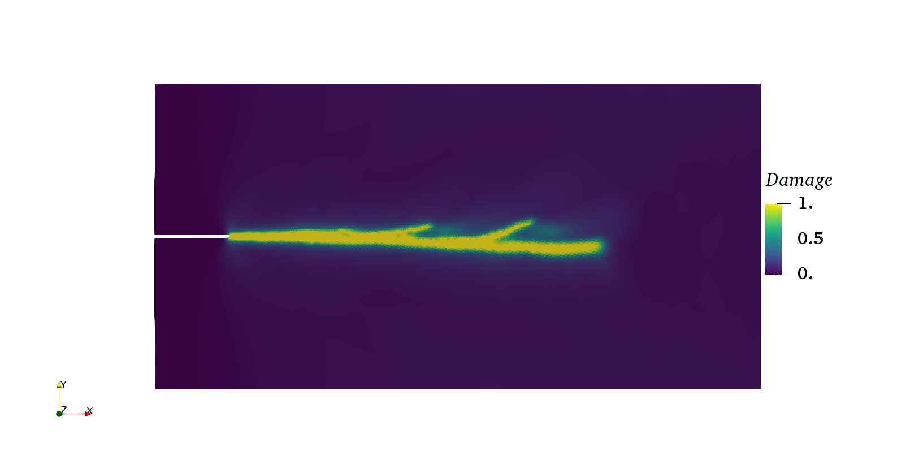

PhaseField Model
================

The phasefield model is a specific implementation of
:cpp:class:`Model <akantu::Model>` interface to handle brittle fracture
for infinitesimal strains.

Theory
------

The variational formulation of brittle fracture was first proposed by
Francfort and Marigo:cite:`franc` so as to overcome the shortcomings
of Griffith's criteria. The approach used by Francfort and Margio for
variational formulation is based on the principle of global minimality
of total energy. Similar to Griffith's work, they define a surface
energy corresponding to the discontinuity :math:`\Gamma` as

.. math::
   \Phi_{s}(\Gamma) = \int\limits_{\Gamma}\mathcal{G}_cd\mathcal{H}^{d-1}(\Gamma)	

   
where :math:`\mathcal{H}^{d-1}` is d-1 dimensional Hausdroff measure
which is surface measure for smooth hypersurfaces. the material
behavior is considered to be linearly elastic with small strains
throughout the body. Based on these assumptions the elastic energy of
the body is defined as

.. math::
   \Phi_e(\Gamma,u) = \int\limits_{\Omega_{p}}\psi(\boldsymbol{\epsilon}(u))d\Omega

where :math:`\psi` is elastic energy density and it is given as a
function of strain as

.. math::
   \psi_e(\boldsymbol{\epsilon}) = \dfrac{1}{2}\lambda(\text{tr}(\boldsymbol{\epsilon}))^{2}+\mu\boldsymbol{\epsilon}:\boldsymbol{\epsilon}

Exponential phasefield law
''''''''''''''''''''''''''
   
Bourdin et. al.:cite:`bourdin` in their work proposed a regularized
version of variational formulation where a scalar field variable
:math:`d(\vec{x},t)` is used to represent crack. This scalar field
variable approximates the sharp crack topology by taking value 1 at
crack location and smoothly diffusing into value 0 away from the
crack. \figref{fig:diffusive_topology} shows both sharp crack topology
and an approximated regularized crack topology for one-dimensional
case.

The strong form of the phasefield can be expressed as

.. math::
   2(1-d)\mathcal{H} - \dfrac{G_c}{l_0}(d-l_0^2d) = 0
   \nabla d . \boldsymbol n = 0

   
Using the PhaseField Model
--------------------------

The :cpp:class:`PhaseFieldModel <akantu::PhaseFieldModel>` object
solves the strong form using an inplicit solver. An instance of the
class can be created like this::

   PhaseFieldModel phase(mesh, spatial_dimension);

while ans existing mesh has been used (see \ref{sect:common:mesh}). To
intialize the model object::

   phase.initFull();

Currently, implicit solver is defined for the phasefield model and no
explicit solver is implemented in Akantu. Furthermore, By default, the
implicit solver defined is of linear type. One can change the linear
solver to a non-linear by initiating a new solver type. 

The phasefield model contains :cpp:class:`Arrays <akantu::Array>`:

:cpp:func:`damage <akantu::PhaseFieldModel::getDamage>`:
     contains the nodal damage :math:`d` (zero by default after the
     initialization)

:cpp:func:`blocked_dofs <akantu::PhaseFieldModel::getBlockedDOFs>`
     contains a Boolean value specifying whether the damage at a node
     is to be blocked or not. A Dirichlet boundary condition can be
     prescribed by setting the **blocked_dofs** value of damage to
     ``true``. The **damage** ais computed for all nodes where the
     **blocked_dofs** value is set to ``false``. For the remaining
     nodes, the imposed values (zero by default after initialization)
     are kept.

:cpp:func:`internal_force <akantu::PhaseFieldModel::getInternalForce>`
     contains the driving force responsible for the crack to nucelate
     or propagate.
   
 Currently, the phasefield model uses a exponential shaped scalar
 field variable :math:`d(\vec{x}, t)` to approximate the sharp crack
 topology. A Phasefield variable thus requires a length scale
 parameter :math:`l_0` to control the width of the diffusive crack
 topology along with the material parameters such as elastic modulus,
 poisson's ratio, critical energy release rate.
 
 The data input file provides the parameters for the exponential
 phasefield law as follows:

.. code-block::
   
   phasefield exponential [
              name = plate
	      E = 210.0 
	      nu =  0.3
	      gc = 5e-3
	      l0 = 0.1
   ]

:cpp:class:`PhaseFieldModel<akantu::PhaseFieldModel>` can handle
 phasefield laws for multiple materials. To define so:
 
.. code-block::
   
   phasefield exponential [
              name = hard
	      E = 210.0
	      nu =  0.3
	      gc = 5e-3
	      l0 = 0.1
   ]

   phasefield exponential [
              name = soft
	      E = 21.0
	      nu =  0.3
	      gc = 5e-5
	      l0 = 0.1
   ]

In order to assign correct phasefield variable properties based on the
names of region as defined in mesh file,
:cpp:class:`MeshDataPhaseFieldSelector
<akantu::MeshDataPhaseFieldSelector>` must be set as phasefield
selector::

  auto && selector = std::make_shared<MeshDataPhaseFieldSelector<std::string>>(
	  "physical_names", phase);
  phase.setPhaseFieldSelector(selector);

For the crack to nucleate or propagate, phasefield model requires
strain measure at each quadrature point. The strain measure computed
from solid mechanics model is provided to the phasefield
model. Similarly, damage value computed at each quadrature point by
the phasefield model is provided to the solid mechanics model. This
damage is thus used to degrade the the elastic strain energy. To do
so, a new material which is a specific implementation of
:cpp:class:`MaterialDamage <akantu::MaterialDamage>` is defined for
solid mechanics model. The governing equation is given as

.. math::
   \boldsymbol \sigma = ((1-d)^2 + \eta)\dfrac{\psi}{\boldsymbol \epsilon}

where :math:`\psi` is the elastic energy and :math:`\eta` is a
numerical parmaeter avoid numerical difficulties due to full
degradation of elastic energy for fully broken state. The material
properties are thus provided in the input data filled as:

.. code-block::

   material phasefield [
	 name = hard
	 rho = 1.
	 E = 210.0
	 nu = 0.3
	 eta = 0.0
	 Plane_Stress = false
   ]

   material phasefield [
	 name = soft
	 rho = 1.
	 E = 21.0
	 nu = 0.3
	 eta = 0.0
	 Plane_Stress = false
   ]

To simplify the execution of phasefield model coupled with
solidmechanis model, a special class
:cpp:class:`CouplerSolidPhaseField<akantu::CouplerSolidPhaseField>` is
provided.

Coupling Phase Field Model and Solid Mechanics Model
''''''''''''''''''''''''''''''''''''''''''''''''''''

A dedicated coupler class :cpp:class:`CouplerSolidPhaseField
<akantu::CouplerSolidPhaseField>` is defined in Akantu to ease the
coupling of the two models.

When an instance of a Coupler class is created, it automatically
creates the instances of solid mechanics model and phasefield
model. The two objects can be retrived from the coupler class.

.. code-block:: c++

   CouplerSolidPhaseField coupler(mesh);
   auto & phase = coupler.getPhaseFieldModel();
   auto & solid = coupler.getSolidMechanicsModel();

The two objects must be used to define the solver type and apply
boundary conditions.

.. code-block:: c++

   solid.initFull(_analysis_method = _explicit_lumped_mass);
   phase.initFull(_analysis_method = _static);

 
The whole proces of coupling the two models at a given time step is
made easy by the :cpp:func:`solve <akantu::CouplerSolidPhaseField::solve>`
function of coupler class.

.. code-block:: c++
   
   coupler.solve(<solver_id_for_solid_model>, <solver_id_for_phasefield_model>);

Staggered scheme
----------------

To solve the solid mechanics model and phasefield model, staggered
scheme is implemented. In staggered scheme, at current time step first
solid mechanics model is solved assuming the damage values from the
previous time step. The strain thus computed are passed to the
phasefield model and now, phasefield model is solved for the damage
variable. At each iteration step, convergence in displacement and
damage is checked for. If convergence is not reached, the combined
newton-raphson iteration continues.

To illustrate the staggered scheme solution of phasefield model, one
can refere to the examples provided for the phasefield model. Two
examples provided are for static `phasefield-static.py` and dynamic
crack propgation `phasefield-dynamic.py`.

For the static problem, both the solid mechanics model and the
phsefield model are solved using alinear implicit solver. Convergence
in value of both displacement as well as damage is checked at each
loading step.

In case of the dynamic problem, solid mechanics model is solved
dynamically using an explicit solver and the phasefield model is
solved using a linear implcit solver. In this sceanrio, the staggered
scheme doesnot check for any convergence. Below is the crack
propagation observed for the dyanmic problem.

.. _fig-phasefieldmodel-dynamic:

   Dynamic crack propagation using phasefield model

..  LocalWords:  phasefield SolidMechanics PhaseField akantu cpp
