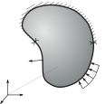
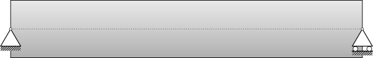
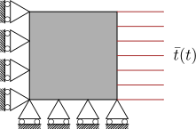
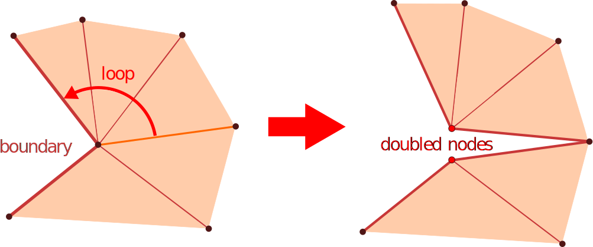
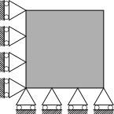
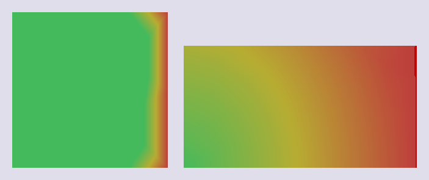
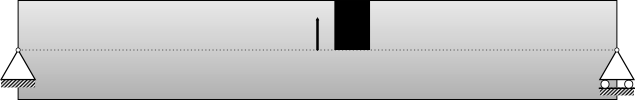
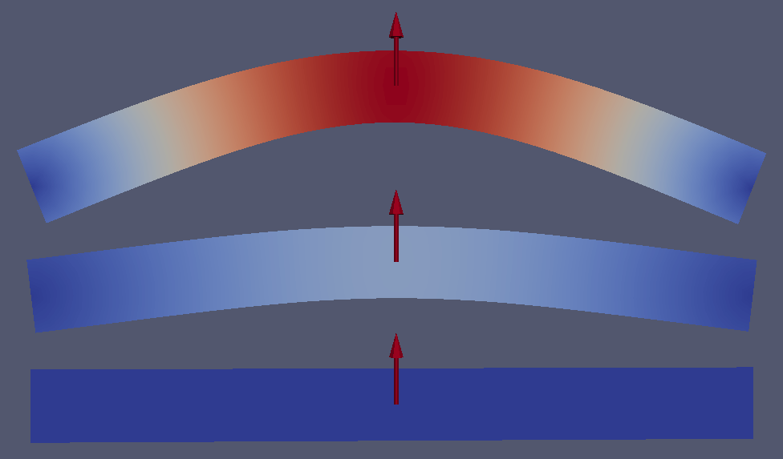
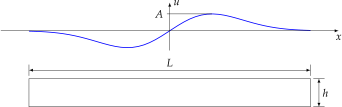

.. _sect-smm:

Solid Mechanics Model
=====================

The solid mechanics model is a specific implementation of the :cpp:class:`Model
<akantu::Model>` interface dedicated to handle the equations of motion or
equations of equilibrium. The model is created for a given mesh. It will create
its own :cpp:class:`FEEngine <akantu::FEEngine>` object to compute the
interpolation, gradient, integration and assembly operations. A
:cpp:class:`SolidMechanicsModel <akantu::SolidMechanicsModel>` object can simply
be created like this::

  SolidMechanicsModel model(mesh);

where ``mesh`` is the mesh for which the equations are to be
solved. A second parameter called ``spatial_dimension`` can be
added after ``mesh`` if the spatial dimension of the problem is
different than that of the mesh.

This model contains at least the following six ``Arrays``:

:cpp:func:`blocked_dofs <akantu::SolidMechanicsModel::getBlockedDOFs>`
    contains a Boolean value for each degree of freedom specifying whether that
    degree is blocked or not. A Dirichlet boundary condition can be prescribed
    by setting the **blocked_dofs** value of a degree of freedom to
    ``true``. A Neumann boundary condition can be applied by setting the
    **blocked_dofs** value of a degree of freedom to ``false``. The
    **displacement**, **velocity** and **acceleration** are
    computed for all degrees of freedom for which the **blocked_dofs**
    value is set to ``false``. For the remaining degrees of freedom, the imposed
    values (zero by default after initialization) are kept.

:cpp:func:`displacement <akantu::SolidMechanicsModel::getDisplacement>`
    contains the displacements of all degrees of freedom. It can be either a
    computed displacement for free degrees of freedom or an imposed displacement
    in case of blocked ones (:math:`\vec{u}` in the following).

:cpp:func:`velocity <akantu::SolidMechanicsModel::getVelocity>`
    contains the velocities of all degrees of freedom. As **displacement**,
    it contains computed or imposed velocities depending on the nature of the
    degrees of freedom (:math:`\dot{\vec{u}}` in the following).

:cpp:func:`acceleration <akantu::SolidMechanicsModel::getAcceleration>`
    contains the accelerations of all degrees of freedom. As **displacement**,
    it contains computed or imposed accelerations depending on the nature of the
    degrees of freedom (:math:`\ddot{\vec{u}}` in the following).

:cpp:func:`external_force <akantu::SolidMechanicsModel::getExternalForce>`
    contains the external forces applied on the nodes
    (:math:`\vec{f}_{\st{ext}}` in the following).

:cpp:func:`internal_force <akantu::SolidMechanicsModel::getInternalForce>`
    contains the internal forces on the nodes (:math:`\vec{f}_{\mathrm{int}}` in
    the following).


Some examples to help to understand how to use this model will be
presented in the next sections. In addition to vector quantities, the solid
mechanics model can be queried for energies with the :cpp:func:`getEnergy
<akantu::SolidMechanicsModel::getEnergy>` which accepts an energy type as an
arguement (e.g. ``kinetic`` or ``potential``).


Model Setup
-----------


Setting Initial Conditions
``````````````````````````

For a unique solution of the equations of motion, initial
displacements and velocities for all degrees of freedom must be
specified:

.. math::
  \vec{u}(t=0) & = \vec{u}_0\\
  \dot{\vec u}(t=0) & = \vec{v}_0

The solid mechanics model can be initialized as
follows::

  model.initFull()

This function initializes the internal arrays and sets them to zero. Initial
displacements and velocities that are not equal to zero can be prescribed by
running a loop over the total number of nodes. Here, the initial displacement in
:math:`x`-direction and the initial velocity in :math:`y`-direction for all
nodes is set to :math:`0.1` and :math:`1`, respectively::

    auto & disp = model.getDisplacement();
    auto & velo = model.getVelocity();

    for (UInt node = 0; node < mesh.getNbNodes(); ++node) {
        disp(node, 0) = 0.1;
        velo(node, 1) = 1.;
    }

.. _sect-smm-boundary:

Setting Boundary Conditions
```````````````````````````

This section explains how to impose Dirichlet or Neumann boundary
conditions. A Dirichlet boundary condition specifies the values that
the displacement needs to take for every point :math:`x` at the boundary
(:math:`\Gamma_u`) of the problem domain (:numref:`fig-smm-boundaries`):

.. math::
  \vec{u} = \bar{\vec u} \quad \forall \vec{x}\in \Gamma_{u}


A Neumann boundary condition imposes the value of the gradient of the
solution at the boundary :math:`\Gamma_t` of the problem domain
(:numref:`fig-smm-boundaries`):

.. math::
    \vec{t} = \mat{\sigma} \vec{n} = \bar{\vec t} \quad
    \forall \vec{x}\in \Gamma_{t}

.. _fig-smm-boundaries:


            Problem domain :math:`\Omega` with boundary in three dimensions. The
            Dirchelet and the Neumann regions of the boundary are denoted with
            :math:`\Gamma_u` and :math:`\Gamma_t`, respecitvely.

Different ways of imposing these boundary conditions exist. A basic
way is to loop over nodes or elements at the boundary and apply local
values. A more advanced method consists of using the notion of the
boundary of the mesh. In the following both ways are presented.

Starting with the basic approach, as mentioned, the Dirichlet boundary
conditions can be applied by looping over the nodes and assigning the
required values. :numref:`fig-smm-dirichlet_bc` shows a beam with a
fixed support on the left side. On the right end of the beam, a load
is applied. At the fixed support, the displacement has a given
value. For this example, the displacements in both the :math:`x` and the
:math:`y`-direction are set to zero. Implementing this displacement boundary
condition is similar to the implementation of initial displacement
conditions described above. However, in order to impose a displacement
boundary condition for all time steps, the corresponding nodes need to
be marked as boundary nodes using the function ``blocked``. While,
in order to impose a load on the right side, the nodes are not marked.
The detail codes are shown as follows

.. code-block:: c++

   auto & blocked = model.getBlockedDOFs();
   const auto & pos = mesh.getNodes();

   UInt nb_nodes = mesh.getNbNodes();

   for (UInt node = 0; node < nb_nodes; ++node) {
     if(Math::are_float_equal(pos(node, _x), 0)) {
       blocked(node, _x) = true; // block dof in x-direction
       blocked(node, _y) = true; // block dof in y-direction
       disp(node, _x) = 0.; // fixed displacement in x-direction
       disp(node, _y) = 0.; // fixed displacement in y-direction
     } else if (Math::are_float_equal(pos(node, _y), 0)) {
       blocked(node, _x) = false; // unblock dof in x-direction
       forces(node, _x) = 10.;    // force in x-direction
     }
   }


.. _fig-smm-dirichlet_bc:


            Beam with fixed support and load.


For the more advanced approach, one needs the notion of a boundary in
the mesh. Therefore, the boundary should be created before boundary
condition functors can be applied. Generally the boundary can be
specified from the mesh file or the geometry.  For the first case, the
function ``createGroupsFromMeshData`` is called.  This function
can read any types of mesh data which are provided in the mesh
file. If the mesh file is created with Gmsh, the function takes one
input strings which is either ``tag_0``, ``tag_1`` or
``physical_names``. The first two tags are assigned by Gmsh to
each element which shows the physical group that they belong to. In
Gmsh, it is also possible to consider strings for different groups of
elements. These elements can be separated by giving a string
``physical_names`` to the function
``createGroupsFromMeshData``

.. code-block:: c++

   mesh.createGroupsFromMeshData<std::string>("physical_names").

Boundary conditions support can also be created from the geometry by calling
``createBoundaryGroupFromGeometry``. This function gathers all the elements on
the boundary of the geometry.

To apply the required boundary conditions, the function :cpp:func:`applyBC
<akantu::BoundaryCondition::applyBC>` needs to be called on a
:cpp:class:`SolidMechanicsModel <akantu::SolidMechanicsModel>`. This function
gets a Dirichlet or Neumann functor and a string which specifies the desired
boundary on which the boundary conditions is to be applied. The functors specify
the type of conditions to apply. Three built-in functors for Dirichlet exist:
:cpp:class:`FlagOnly <akantu::BC::Dirichlet::FlagOnly>`, :cpp:class:`FixedValue
<akantu::BC::Dirichlet::FixedValue>` and :cpp:class:`IncrementValue
<akantu::BC::Dirichlet::IncrementValue>`. The functor ``FlagOnly`` is used if a
point is fixed in a given direction. Therefore, the input parameter to this
functor is only the fixed direction. The ``FixedValue`` functor is used when a
displacement value is applied in a fixed direction. The ``IncrementValue``
applies an increment to the displacement in a given direction. The following
code shows the utilization of three functors for the top, bottom and side
surface of the mesh which were already defined in the Gmsh

.. code-block:: c++

   model.applyBC(BC::Dirichlet::FixedValue(13.0, _y), "Top");
   model.applyBC(BC::Dirichlet::FlagOnly(_x), "Bottom");
   model.applyBC(BC::Dirichlet::IncrementValue(13.0, _x), "Side");

To apply a Neumann boundary condition, the applied traction or stress should be
specified before. In case of specifying the traction on the surface, the functor
:cpp:class:`FromTraction <akantu::BC::Neumann::FromTraction>` of Neumann
boundary conditions is called. Otherwise, the functor :cpp:class:`FromStress
<akantu::BC::Neumann::FromStress>` should be called which gets the stress tensor
as an input parameter

.. code-block:: c++

   Vector<Real> surface_traction{0., 0., 1.};
   auto surface_stress(3, 3) = Matrix<Real>::eye(3);

   model.applyBC(BC::Neumann::FromTraction(surface_traction), "Bottom");
   model.applyBC(BC::Neumann::FromStress(surface_stress), "Top");

If the boundary conditions need to be removed during the simulation, a
functor is called from the Neumann boundary condition to free those
boundary conditions from the desired boundary

.. code-block:: c++

    model.applyBC(BC::Neumann::FreeBoundary(), "Side");

User specified functors can also be implemented.  A full example for
setting both initial and boundary conditions can be found in
``examples/boundary_conditions.cc``.  The problem solved
in this example is shown in :numref:`fig-smm-bc_and_ic`. It consists
of a plate that is fixed with movable supports on the left and bottom
side. On the right side, a traction, which increases linearly with the
number of time steps, is applied. The initial displacement and
velocity in :math:`x`-direction at all free nodes is zero and two
respectively.

.. _fig-smm-bc_and_ic:


            Plate on movable supports.

..
   \begin{figure}[!htb]
     \centering
     \includegraphics[scale=0.8]{figures/bc_and_ic_example}
     \caption{Plate on movable supports.\label{fig-smm-bc_and_ic}}
   \end{figure}

As it is mentioned in Section \ref{sect:common:groups}, node and
element groups can be used to assign the boundary conditions. A
generic example is given below with a Dirichlet boundary condition::

     // create a node group
     NodeGroup & node_group = mesh.createNodeGroup("nodes_fix");

     /* fill the node group with the nodes you want */

     // create an element group using the existing node group
     mesh.createElementGroupFromNodeGroup("el_fix",
                                          "nodes_fix",
                                          spatial_dimension-1);

     // boundary condition can be applied using the element group name
     model.applyBC(BC::Dirichlet::FixedValue(0.0, _x), "el_fix");

Material Selector
`````````````````

If the user wants to assign different materials to different
finite elements groups in ``Akantu``, a material selector has to be
used. By default, ``Akantu`` assigns the first valid material in the
material file to all elements present in the model (regular continuum
materials are assigned to the regular elements and cohesive materials
are assigned to cohesive elements or element facets).

To assign different materials to specific elements, mesh data information such
as tag information or specified physical names can be used.
:cpp:class:`MeshDataMaterialSelector <akantu::MeshDataMaterialSelector>` class
uses this information to assign different materials. With the proper physical
name or tag name and index, different materials can be assigned as demonstrated
in the examples below::

     auto mat_selector =
        std::make_shared<MeshDataMaterialSelector<std::string>>("physical_names",
                                                                model);
     model.setMaterialSelector(mat_selector);

In this example the physical names specified in a GMSH geometry file will by
used to match the material names in the input file.

Another example would be to use the first (``tag_0``) or the second
(``tag_1``) tag associated to each elements in the mesh::

     auto mat_selector = std::make_shared<MeshDataMaterialSelector<UInt>>(
         "tag_1", model, first_index);
     model.setMaterialSelector(*mat_selector);

where ``first_index`` (default is 1) is the value of ``tag_1`` that will
be associated to the first material in the material input file. The following
values of the tag will be associated with the following materials.

There are four different material selectors pre-defined in ``Akantu``.
:cpp:class:`MaterialSelector <akantu::MaterialSelector>` and
:cpp:class:`DefaultMaterialSelector <akantu::DefaultMaterialSelector>` is used
to assign a material to regular elements by default. For the regular elements,
as in the example above, :cpp:class:`MeshDataMaterialSelector
<akantu::MeshDataMaterialSelector>` can be used to assign different materials to
different elements.

Apart from the ``Akantu``'s default material selectors, users can always
develop their own classes in the main code to tackle various
multi-material assignment situations.

For cohesive material, ``Akantu`` has a pre-defined material selector to assign
the first cohesive material by default to the cohesive elements which is called
:cpp:class:`DefaultMaterialCohesiveSelector
<akantu::DefaultMaterialCohesiveSelector>` and it inherits its properties from
:cpp:class:`DefaultMaterialSelector <akantu::DefaultMaterialSelector>`. Multiple
cohesive materials can be assigned using mesh data information (for more
details, see :ref:`sect-smm-intrinsic-insertion`).


Insertion of Cohesive Elements
``````````````````````````````
Cohesive elements are currently compatible only with static simulation
and dynamic simulation with an explicit time integration scheme (see
section :ref:`ssect-smm-expl-time-integration`). They do not have to be
inserted when the mesh is generated (intrinsic) but can be added
during the simulation (extrinsic). At any time during the simulation,
it is possible to access the following energies with the relative
function:

.. code-block:: c++

  Real Ed = model.getEnergy("dissipated");
  Real Er = model.getEnergy("reversible");
  Real Ec = model.getEnergy("contact");

A new model have to be call in a very similar way that the solid
mechanics model:

.. code-block:: c++

  SolidMechanicsModelCohesive model(mesh);
  model.initFull(_analysis_method = _explicit_lumped_mass,
                 _is_extrinsic = true);

Cohesive element insertion can be either realized at the beginning of
the simulation or it can be carried out dynamically during the
simulation. The first approach is called ``intrinsic``, the second
one ``extrinsic``. When an element is present from the beginning, a
bi-linear or exponential cohesive law should be used instead of a
linear one. A bi-linear law works exactly like a linear one except for
an additional parameter :math:`\delta_0` separating an initial linear
elastic part from the linear irreversible one. For additional details
concerning cohesive laws see Section~\ref{sec:cohesive-laws}.

.. _fig-smm-coh-insertion:


            Insertion of a cohesive element.

Extrinsic cohesive elements are dynamically inserted between two
standard elements when

.. math::
   \sigma_\mathrm{eff} > \sigma_\mathrm{c} \quad\text {with} \quad \sigma_\mathrm{eff} = \sqrt{\sigma_\mathrm{n} ^ 2 + \frac{\tau ^ 2} {\beta ^ 2 }}

in which :math:`\sigma_\mathrm { n }
` is the tensile normal traction and $\tau$ the resulting tangential one(  :numref:`fig-smm-coh-insertion`).

Extrinsic approach
''''''''''''''''''

During the simulation, stress has to be checked along each facet in order to
insert cohesive elements where the stress criterion is reached. This check is
performed by calling the method :cpp:func:`checkCohesiveStress
<akantu::SolidMechanicsModelCohesive::checkCohesiveStress>`, as example before
each step resolution:

.. code-block:: c++

   model.checkCohesiveStress();
   model.solveStep();

The area where stresses are checked and cohesive elements inserted can be
limited using the method :cpp:func:`setLimit
<akantu::CohesiveInserter::setLimit>` on the :cpp:class:`CohesiveInserter
<akantu::CohesiveInserter>` during initialization. As example, to limit
insertion in the range :math:`[-1.5, 1.5]` in the $x$ direction:

.. code-block:: c++

  auto & inserter = model.getElementInserter();
  inserter.setLimit(_x, -1.5, 1.5);

Additional restrictions with respect to :math:`_y` and :math:`_z` directions can
be added as well.

.. _sect-smm-intrinsic-insertion:

Intrinsic approach
''''''''''''''''''

Intrinsic cohesive elements are inserted in the mesh with the method
:cpp:func:`initFull <akantu::SolidMechanicsModelCohesive::initFull>`.
Similarly, the range of insertion can be limited with :cpp:func:`setLimit
<akantu::CohesiveInserter::setLimit>` before the :cpp:func:`initFull
<akantu::SolidMechanicsModelCohesive::initFull>` call.

In both cases extrinsic and intrinsic the insertion can be restricted to
surfaces or element groups. To do so the list of groups should be specified in
the input file.

.. code-block::

  model solid_mechanics_model_cohesive [
    cohesive_inserter [
      cohesive_surfaces = [surface1, surface2, ...]
      cohesive_zones = [group1, group2, ...]
    ]

    material cohesive_linear [
      name = insertion
      beta = 1
      G_c = 10
      sigma_c = 1e6
    ]
  ]


Static Analysis
---------------

The :cpp:class:`SolidMechanicsModel <akantu::SolidMechanicsModel>` class can
handle different analysis methods, the first one being presented is the static
case. In this case, the equation to solve is

.. math::
     \mat{K} \vec{u} = \vec{f}_{\mathrm{ext}}
     :label: eqn-smm-static

where :math:`\mat{K}` is the global stiffness matrix, :math:`\vec{u}` the
displacement vector and :math:`\vec{f}_{\st{ext}}` the vector of external
forces applied to the system.

To solve such a problem, the static solver of the
:cpp:class:`SolidMechanicsModel <akantu::SolidMechanicsModel>` object is used.
First, a model has to be created and initialized. To create the model, a mesh
(which can be read from a file) is needed, as explained in
Section~\ref{sect:common:mesh}. Once an instance of a
:cpp:class:`SolidMechanicsModel <akantu::SolidMechanicsModel>` is obtained, the
easiest way to initialize it is to use the :cpp:func:`initFull
<akantu::SolidMechanicsModel::initFull>` method by giving the
:cpp:class:`SolidMechanicsModelOptions <akantu::SolidMechanicsModelOptions>`.
These options specify the type of analysis to be performed and whether the
materials should be initialized with :cpp:func:`initMaterials
<akantu::SolidMechanicsModel::initMaterials>` or not

.. code-block:: c++

   SolidMechanicsModel model(mesh);
   model.initFull(_analysis_method = _static);

Here, a static analysis is chosen by passing the argument
:cpp:enumerator:`_static <akantu::_static>` to the method. By default, the
Boolean for no initialization of the materials is set to false, so that they are
initialized during the ``initFull``. The method ``initFull`` also initializes
all appropriate vectors to zero. Once the model is created and initialized, the
boundary conditions can be set as explained in Section :ref:`sect-smm-boundary`.
Boundary conditions will prescribe the external forces for some free degrees of
freedom :math:`\vec{f}_{\st{ext}}` and displacements for some others. At this
point of the analysis, the function
:cpp:func:`solveStep <akantu::SolidMechanicsModel::solveStep>` can be called

.. code-block:: c++

   auto & solver = model.getNonLinearSolver();
   solver.set("max_iterations", 1);
   solver.set("threshold", 1e-4);
   solver.set("convergence_type", SolveConvergenceCriteria::_residual);

   model.solveStep();

This function is templated by the solving method and the convergence criterion
and takes two arguments: the tolerance and the maximum number of iterations (100
by default), which are :math:`10^{-4}` and :math:`1` for this example. The
modified Newton-Raphson method is chosen to solve the system. In this method,
the equilibrium equation (:eq:`eqn-smm-static`) is modified in order to apply a
Newton-Raphson convergence algorithm:

.. math::
     \mat{K}^{i+1}\delta\vec{u}^{i+1} &= \vec{r} \\
     &= \vec{f}_{\st{ext}} -\vec{f}_{\st{int}}\\
     &= \vec{f}_{\st{ext}} - \mat{K}^{i} \vec{u}^{i}\\
     \vec{u}^{i+1} &= \vec{u}^{i} + \delta\vec{u}^{i+1}~,

where :math:`\delta\vec{u}` is the increment of displacement to be added from
one iteration to the other, and :math:`i` is the Newton-Raphson iteration
counter. By invoking the ``solveStep`` method in the first step, the global
stiffness matrix :math:`\mat{K}` from (:eq:`eqn-smm-static`) is automatically
assembled. A Newton-Raphson iteration is subsequently started, :math:`\mat{K}`
is updated according to the displacement computed at the previous iteration and
one loops until the forces are balanced
(:cpp:enumerator:`SolveConvergenceCriteria::_residual
<akantu::SolveConvergenceCriteria::_residual>`), i.e. :math:`||\vec{r}|| <`
:cpp:member:`threshold
<akantu::NonLinearSolverNewtonRaphson::convergence_criteria>`. One can also
iterate until the increment of displacement is zero
(:cpp:enumerator:`SolveConvergenceCriteria::_solution
<akantu::SolveConvergenceCriteria::_solution>`) which also means that the
equilibrium is found. For a linear elastic problem, the solution is obtained in
one iteration and therefore the maximum number of iterations can be set to one.
But for a non-linear case, one needs to iterate as long as the norm of the
residual exceeds the tolerance threshold and therefore the maximum number of
iterations has to be higher, e.g. :math:`100`

.. code-block:: c++

   solver.set("max_iterations", 100);
   model.solveStep();

At the end of the analysis, the final solution is stored in the
**displacement** vector.  A full example of how to solve a static
problem is presented in the code ``examples/static/static.cc``.
This example is composed of a 2D plate of steel, blocked with rollers
on the left and bottom sides as shown in :numref:`fig-smm-static`.
The nodes from the right side of the sample are displaced by :math:`0.01\%`
of the length of the plate.

.. _fig-smm-static:


            Numerical setup.

The results of this analysis is depicted in
:numref:`fig-smm-implicit:static_solution`.

.. _fig-smm-implicit:static_solution:


            Solution of the static analysis. Left: the initial condition, right:
            the solution (deformation magnified 50 times).


Dynamic Methods
---------------

Different ways to solve the equations of motion are implemented in the
solid mechanics model.  The complete equations that should be solved
are:

.. math:: \mat{M}\ddot{\vec{u}} + \mat{C}\dot{\vec{u}} + \mat{K}\vec{u} = \vec{f}_{\mathrm{ext}}
   :label: eqn-equation-motion

where :math:`\mat{M}`, :math:`\mat{C}` and :math:`\mat{K}` are the mass,
damping and stiffness matrices, respectively.

In the previous section, it has already been discussed how to solve this
equation in the static case, where :math:`\ddot{\vec{u}} = \dot{\vec{u}} = 0`.
Here the method to solve this equation in the general case will be presented.
For this purpose, a time discretization has to be specified. The most common
discretization method in solid mechanics is the Newmark-:math:`\beta` method,
which is also the default in ``Akantu``.

For the Newmark-:math:`\beta` method, (:eq:`eqn-equation-motion`) becomes a
system of three equations (see :cite:`curnier92a,hughes-83a` for more details):

.. math::
   \begin{eqnarray}
     \mat{M} \ddot{\vec{u}}_{n+1} + \mat{C}\dot{\vec{u}}_{n+1} + \mat{K} \vec{u}_{n+1} &={\vec{f}_{\st{ext}}}_{\, n+1}\\
     \vec{u}_{n+1} &= \vec{u}_{n}
                      + \left(1 - \alpha\right) \Delta t \dot{\vec{u}}_{n}
                      + \alpha \Delta t \dot{\vec{u}}_{n+1}
                      + \left(\frac{1}{2} - \alpha\right) \Delta t^2 \ddot{\vec{u}}_{n}\\
     \dot{\vec{u}}_{n+1} &= \dot{\vec{u}}_{n}
                            + \left(1 - \beta\right) \Delta t \ddot{\vec{u}}_{n}
                            + \beta \Delta t \ddot{\vec{u}}_{n+1}
   \end{eqnarray}
   :label: eqn-equation-motion-discret

In these new equations, :math:`\ddot{\vec{u}}_{n}`, :math:`\dot{\vec{u}}_{n}`
and :math:`\vec{u}_{n}` are the approximations of :math:`\ddot{\vec{u}}(t_n)`,
:math:`\dot{\vec{u}}(t_n)` and :math:`\vec{u}(t_n)`.
Equation~(:eq:`eqn-equation-motion-discret`) is the equation of motion
discretized in space (finite-element discretization), and the equations above
are discretized in both space and time (Newmark discretization). The
:math:`\alpha` and :math:`\beta` parameters determine the stability and the
accuracy of the algorithm. Classical values for :math:`\alpha` and :math:`\beta`
are usually :math:`\beta = 1/2` for no numerical damping and :math:`0 < \alpha <
1/2`.

.. csv-table::
   :header: ":math:`\\alpha`", "Method (:math:`\\beta = 1/2`)", "Type"

   ":math:`0`", "central difference", "explicit"
   ":math:`\frac{1}{6}`", "Fox-Goodwin(royal road)", "implicit"
   ":math:`\frac{1}{3}`", "Linear acceleration", "implicit"
   ":math:`\frac{1}{2}`", "Average acceleration (trapeziodal rule)", "implicit"


The solution of this system of equations,
(:eq:`eqn-equation-motion-discret`) is
split into a predictor and a corrector system of equations.  Moreover,
in the case of a non-linear equations, an iterative algorithm such as
the Newton-Raphson method is applied. The system of equations can be
written as:

- *Predictor*:

  .. math:: \vec{u}_{n+1}^{0} &= \vec{u}_{n} + \Delta t \dot{\vec{u}}_{n} + \frac{\Delta t^2}{2} \ddot{\vec{u}}_{n} \\
            \dot{\vec{u}}_{n+1}^{0} &= \dot{\vec{u}}_{n} + \Delta t \ddot{\vec{u}}_{n} \\
            \ddot{\vec{u}}_{n+1}^{0} &= \ddot{\vec{u}}_{n}

- *Solve*:

  .. math:: \left(c \mat{M} + d \mat{C} + e \mat{K}_{n+1}^i\right)
            \vec{w} &= {\vec{f}_{\st{ext}}}_{\,n+1} - {\vec{f}_{\st{int}}}_{\,n+1}^i -
            \mat{C} \dot{\vec{u}}_{n+1}^i - \mat{M} \ddot{\vec{u}}_{n+1}^i\\
            &= \vec{r}_{n+1}^i

- *Corrector*:

  .. math:: \ddot{\vec{u}}_{n+1}^{i+1} &= \ddot{\vec{u}}_{n+1}^{i} +c \vec{w} \\
            \dot{\vec{u}}_{n+1}^{i+1} &= \dot{\vec{u}}_{n+1}^{i} + d\vec{w} \\
            \vec{u}_{n+1}^{i+1} &= \vec{u}_{n+1}^{i} + e \vec{w}

where :math:`i` is the Newton-Raphson iteration counter and :math:`c`, :math:`d` and :math:`e`
are parameters depending on the method used to solve the equations


.. csv-table::
   :header: "", ":math:`\\vec{w}`", ":math:`e`", ":math:`d`", ":math:`c`"

   "in acceleration", ":math:`\delta\ddot{\vec{u}}`", ":math:`\alpha\beta\Delta t^2`", ":math:`\beta\Delta t`", ":math:`1`"
   "in velocity", ":math:`\delta\dot{\vec{u}}`", ":math:`\alpha\Delta t`", ":math:`1`", ":math:`\frac{1}{\beta\Delta t}`"
   "in displacement", ":math:`\delta\vec{u}`", ":math:`1`", ":math:`\frac{1}{\alpha\Delta t}`", ":math:`\frac{1}{\alpha\beta \Delta t^2}`"


.. note:: If you want to use the implicit solver ``Akantu`` should be compiled at
          least with one sparse matrix solver such as `Mumps
          <http://mumps.enseeiht.fr/>`_ :cite:`mumps`.


Implicit Time Integration
`````````````````````````

To solve a problem with an implicit time integration scheme, first a
:cpp:class:`SolidMechanicsModel <akantu::SolidMechanicsModel>` object has to be
created and initialized. Then the initial and boundary conditions have to be
set. Everything is similar to the example in the static case
(Section~\ref{sect:smm:static}), however, in this case the implicit dynamic
scheme is selected at the initialization of the model::

   SolidMechanicsModel model(mesh);
   model.initFull(_analysis_method = _implicit_dynamic);

Because a dynamic simulation is conducted, an integration time step
:math:`\Delta t` has to be specified. In the case of implicit simulations,
``Akantu`` implements a trapezoidal rule by default.  That is to say
:math:`\alpha = 1/2` and :math:`\beta = 1/2` which is unconditionally
stable. Therefore the value of the time step can be chosen arbitrarily
within reason::

   model.setTimeStep(time_step);

Since the system has to be solved for a given amount of time steps, the
method ``solveStep()``, (which has already been used in the static
example in Section~\ref{sect:smm:static}), is called inside a time
loop::

   /// time loop
   Real time = 0.;

   auto & solver = model.getNonLinearSolver();
   solver.set("max_iterations", 100);
   solver.set("threshold", 1e-12);
   solver.set("convergence_type", SolveConvergenceCriteria::_solution);

   for (UInt s = 1; time <max_time; ++s, time += time_step) {
       model.solveStep();
   }

An example of solid mechanics with an implicit time integration scheme is
presented in ``examples/implicit/implicit_dynamic.cc``. This example consists of
a 3D beam of
:math:`10\mathrm{m}\times1\mathrm{m}\times1\mathrm{m}` blocked
on one side and is on a roller on the other side. A constant force of
:math:`5\mathrm{kN}` is applied in its middle.
:numref:`fig-smm-implicit-dynamic` presents the geometry of this case. The
material used is a fictitious linear elastic material with a density of
:math:`1000 \mathrm{kg/m}^3`, a Young's Modulus of
:math:`120 \mathrm{MPa}` and Poisson's ratio of :math:`0.3`. These values
were chosen to simplify the analytical solution.

An approximation of the dynamic response of the middle point of the
beam is given by:

.. math::

    u\left(\frac{L}{2}, t\right)
    = \frac{1}{\pi^4} \left(1 - cos\left(\pi^2 t\right) +
    \frac{1}{81}\left(1 - cos\left(3^2 \pi^2 t\right)\right) +
    \frac{1}{625}\left(1 - cos\left(5^2 \pi^2 t\right)\right)\right)

.. _fig-smm-implicit-dynamic:


            Numerical setup.

..
   \begin{figure}[!htb]
     \centering
     \includegraphics[scale=.6]{figures/implicit_dynamic}
     \caption{Numerical setup}
     \label{fig-smm-implicit:dynamic}
   \end{figure}

:numref:`fig-smm-implicit-dynamic_solution` presents the deformed
beam at 3 different times during the simulation: time steps 0, 1000 and
2000.

.. _fig-smm-implicit-dynamic_solution:


            Deformed beam at three different times (displacement :math:`\times
            10`).

.. _ssect-smm-expl-time-integration:

Explicit Time Integration
`````````````````````````

The explicit dynamic time integration scheme is based on the
Newmark-:math:`\beta` scheme with :math:`\alpha=0` (see equations
\ref{eqn:equation-motion-discret}-\ref{eqn:finite-difference-2}).  In
``Akantu``, :math:`\beta` is defaults to :math:`\beta=1/2`, see section
\ref{sect:smm:Dynamic_methods}.

The initialization of the simulation is similar to the static and implicit
dynamic version. The model is created from the :cpp:class:`SolidMechanicsModel
<akantu::SolidMechanicsModel>` class. In the initialization, the explicit scheme
is selected using the ``_explicit_lumped_mass`` constant::

   SolidMechanicsModel model(mesh);
   model.initFull(_analysis_method = _explicit_lumped_mass);


.. note::
    Writing ``model.initFull()`` or ``model.initFull();`` is
    equivalent to use the ``_explicit_lumped_mass`` keyword, as this
    is the default case.

The explicit time integration scheme implemented in ``Akantu`` uses a
lumped mass matrix :math:`\mat{M}` (reducing the computational cost). This
matrix is assembled by distributing the mass of each element onto its
nodes. The resulting :math:`\mat{M}` is therefore a diagonal matrix stored
in the **mass** vector of the model.

The explicit integration scheme is conditionally stable. The time step
has to be smaller than the stable time step which is obtained in
Akantu as follows::

   critical_time_step = model.getStableTimeStep();

The stable time  step corresponds to the time the fastest wave (the compressive
wave) needs to travel the characteristic length of the mesh:

.. math::
   \Delta t_{\st{crit}} = \frac{\Delta x}{c}

where :math:`\Delta x` is a characteristic length (\eg the inradius in the case
of linear triangle element) and :math:`c` is the celerity of the fastest wave in
the material. It is generally the compressive wave of celerity :math:`c =
\sqrt{\frac{2 \mu + \lambda}{\rho}}`, :math:`\mu` and :math:`\lambda` are the
first and second Lame's coefficients and :math:`\rho` is the density. However,
it is recommended to impose a time step that is smaller than the stable time
step, for instance, by multiplying the stable time step by a safety factor
smaller than one::

   const Real safety_time_factor = 0.8;
   Real applied_time_step = critical_time_step * safety_time_factor;
   model.setTimeStep(applied_time_step);

The initial displacement and velocity fields are, by default, equal to zero if
not given specifically by the user (see \ref{sect:smm:initial_condition}).

Like in implicit dynamics, a time loop is used in which the
displacement, velocity and acceleration fields are updated at each
time step. The values of these fields are obtained from the
Newmark:math:`-\beta` equations with :math:`\beta=1/2` and :math:`\alpha=0`. In ``Akantu``
these computations at each time step are invoked by calling the
function ``solveStep``::

   for (UInt s = 1; (s-1)*applied_time_step < total_time; ++s) {
     model.solveStep();
   }

The method ``solveStep`` wraps the four following functions:

- ``model.explicitPred()`` allows to compute the displacement
  field at :math:`t+1` and a part of the velocity field at :math:`t+1`, denoted by
  :math:`\vec{\dot{u}^{\st{p}}}_{n+1}`, which will be used later in the method
  ``model.explicitCorr()``. The equations are:

   .. math::
      \vec{u}_{n+1} &= \vec{u}_{n} + \Delta t
      \vec{\dot{u}}_{n} + \frac{\Delta t^2}{2} \vec{\ddot{u}}_{n}\\
      \vec{\dot{u}^{\st{p}}}_{n+1} &= \vec{\dot{u}}_{n} + \Delta t
      \vec{\ddot{u}}_{n}

- ``model.updateResidual()`` and ``model.updateAcceleration()`` compute the acceleration increment
  :math:`\delta \vec{\ddot{u}}`:

  .. math::
     \left(\mat{M} + \frac{1}{2} \Delta t \mat{C}\right)
     \delta \vec{\ddot{u}} = \vec{f_{\st{ext}}} - \vec{f}_{\st{int}\, n+1}
     - \mat{C} \vec{\dot{u}^{\st{p}}}_{n+1} - \mat{M} \vec{\ddot{u}}_{n}

  The internal force :math:`\vec{f}_{\st{int}\, n+1}` is computed from the
    displacement :math:`\vec{u}_{n+1}` based on the constitutive law.

- ``model.explicitCorr()`` computes the velocity and
  acceleration fields at :math:`t+1`:

  .. math::
     \vec{\dot{u}}_{n+1} &= \vec{\dot{u}^{\st{p}}}_{n+1} + \frac{\Delta t}{2}
     \delta \vec{\ddot{u}} \\ \vec{\ddot{u}}_{n+1} &=
     \vec{\ddot{u}}_{n} + \delta \vec{\ddot{u}}

The use of an explicit time integration scheme is illustrated by the example:
``examples/explicit/explicit_dynamic.cc``. This example models the propagation
of a wave in a steel beam. The beam and the applied displacement in the
:math:`x` direction are shown in :numref:`fig-smm-explicit`.


.. _fig-smm-explicit:


            Numerical setup.


The length and height of the beam are :math:`L={10}\textrm{m}` and :math:`h =
{1}\textrm{m}`, respectively. The material is linear elastic, homogeneous and
isotropic (density: :math:`7800\mathrm{kg/m}^3`, Young's modulus:
:math:`210\mathrm{GPa}` and Poisson's ratio: :math:`0.3`). The imposed
displacement follow a Gaussian function with a maximum amplitude of :math:`A =
{0.01}\textrm{m}`. The potential, kinetic and total energies are computed. The
safety factor is equal to :math:`0.8`.

.. include:: ./constitutive-laws.rst

.. include:: ./new-constitutive-laws.rst
