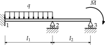

Structural Mechanics Model
==========================

Static structural mechanics problems can be handled using the class
:cpp:class:`StructuralMechanicsModel <akantu::StructuralMechanicsModel>`. So
far, ``Akantu`` provides 2D and 3D Bernoulli beam elements :cite:`frey2009`.
This model is instantiated for a given :cpp:class:`Mesh <akantu::Mesh>`, as for
the :cpp:class:`SolidMechanicsModel <akantu::SolidMechanicsModel>`. The model
will create its own :cpp:class:`FEEngine <akantu::FEEngine>` object to compute
the interpolation, gradient, integration and assembly operations. The
:cpp:class:`StructuralMechanicsModel <akantu::StructuralMechanicsModel>`
constructor is called in the following way:

.. code-block:: c++

   StructuralMechanicsModel model(mesh, spatial_dimension);

where ``mesh`` is a :cpp:class:`Mesh <akantu::Mesh>` object defining the structure for
which the equations of statics are to be solved, and
``spatial_dimension`` is the dimensionality of the problem.  If
``spatial_dimension`` is omitted, the problem is assumed to have
the same dimensionality as the one specified by the mesh.

.. warning::
   Dynamic computations are not supported to date.

.. note::
   Structural meshes are created and loaded
   with ``_miot_gmsh_struct`` instead  of ``_miot_gmsh`` (cf. :ref:`loading mesh`)

   .. code-block:: c++

      Mesh mesh;
      mesh.read("structural_mesh.msh", _miot_gmsh_struct);


This model contains at least the following :cpp:class:`Arrays <akantu::Arrays>`:

- **blocked_dofs** contains a Boolean value for each degree of
  freedom specifying whether that degree is blocked or not. A
  Dirichlet boundary condition can be prescribed by setting the
  **blocked_dofs** value of a degree of freedom to
  ``true``. The **displacement** is computed for all degrees
  of freedom for which the **blocked_dofs** value is set to
  ``false``. For the remaining degrees of freedom, the imposed
  values (zero by default after initialization) are kept.

- **displacement_rotation** contains the generalized displacements (*i.e.* displacements and rotations) of all degrees of freedom. It can be either a computed displacement for free degrees of freedom or an imposed displacement in case of blocked ones (:math:`\vec{u}` in the following).

- **external_force** contains the generalized external forces (forces and moments) applied to the nodes (:math:`\vec{f_{\st{ext}}}` in the following).

- **internal_force** contains the generalized internal forces (forces and moments) applied to the nodes (:math:`\vec{f_{\st{int}}}` in the following).

An example to help understand how  to use this model will be presented in the
next section.

.. _sec:structMechMod:setup:

Model Setup
-----------

Initialization
``````````````

The easiest way to initialize the structural mechanics model is:

.. code-block:: c++

   model.initFull();

The method :cpp:class:`initFull <akantu::StructuralMechanicsModel::initFull>` computes the shape
functions, initializes the internal vectors mentioned above and allocates the
memory for the stiffness matrix, unlike the solid mechanics model, its default
argument is ``_static``.

Material properties are defined using the :cpp:class:`StructuralMaterial
<akantu::StructuralMaterial>` structure described in
:numref:`tab-structmechmod-strucmaterial`. Such a definition could, for
instance, look like

.. code-block:: c++

   StructuralMaterial mat1;
   mat.E=3e10;
   mat.I=0.0025;
   mat.A=0.01;

.. _tab-structmechmod-strucmaterial:

.. table:: Material properties  for structural elements  defined in the class :cpp:class:`StructuralMaterial <akantu::StructuralMaterial>`.
   :align: center

   ======  ======
   Field   Description
   ======  ======
   ``E``   Young's  modulus
   ``A``   Cross  section  area
   ``I``   Second cross sectional  moment of inertia (for 2D elements)
   ``Iy``  ``I``  around beam :math:`y`--axis (for 3D elements)
   ``Iz``  ``I``  around beam :math:`z`--axis (for 3D elements)
   ``GJ``  Polar  moment of inertia  of beam  cross section (for 3D elements)
   ======  ======

Materials can be added to the model's ``element_material`` vector using

.. code-block:: c++

  model.addMaterial(mat1);

They are successively numbered and then assigned to specific elements.

.. code-block:: c++

   for (UInt i = 0; i < nb_element_mat_1; ++i) {
     model.getElementMaterial(_bernoulli_beam_2)(i,0) = 1;
   }


.. _sect:structMechMod:boundary:

Setting Boundary Conditions
```````````````````````````
As explained before, the Dirichlet boundary conditions are applied through the
array **blocked_dofs**. Two options exist to define Neumann conditions.
If a nodal force is applied, it has to be directly set in the array
**force_momentum**. For loads distributed along the beam length, the
method :cpp:class:`computeForcesFromFunction <akantu::computeForcesFromFunction>` integrates them into nodal forces.  The
method takes as input a function describing the distribution of loads along the
beam and a functor :cpp:class:`BoundaryFunctionType <akantu::BoundaryFunctionType>` specifing if the function is expressed in the local coordinates (``_bft_traction_local``) or in the
global system of coordinates (``_bft_traction``).

.. code-block:: c++

   static void lin_load(double * position, double * load,
                        Real * normal, UInt surface_id){
     memset(load,0,sizeof(Real)*3);
     load[1] = position[0]*position[0]-250;
   }
   int main(){
     ...
     model.computeForcesFromFunction<_bernoulli_beam_2>(lin_load,
                                                        _bft_traction_local);
     ...
   }


.. _sect:structMechMod:static:

Static Analysis
---------------

The :cpp:class:`StructuralMechanicsModel <akantu::StructuralMechanicsModel>` class can perform static analyses of structures.  In this case, the equation to solve is the same as for the :cpp:class:`SolidMechanicsModel <akantu::SolidMechanicsModel>` used for static analyses

.. math:: \mat{K} \vec{u} = \vec{f_{\st{ext}}}~,
   :label: eqn-structmechmod-static

where :math:`\mat{K}` is the global stiffness matrix, :math:`\vec{u}` the
generalized displacement vector and :math:`\vec{f_{\st{ext}}}` the vector of
generalized external forces applied to the system.

To solve such a problem, the static solver of the
:cpp:class:`StructuralMechanicsModel <akantu::StructuralMechanicsModel>` object
is used. First a model has to be created and initialized.

.. code-block:: c++

   StructuralMechanicsModel model(mesh);
   model.initFull();

- :cpp:func:`model.initFull <akantu::StructuralMechanicsModel::initFull>` initializes all
  internal vectors to zero.

Once the model is created and initialized, the boundary conditions can be set as explained in Section :ref:`sect:structMechMod:boundary`. Boundary conditions will prescribe the external forces or moments for the free degrees of freedom :math:`\vec{f_{\st{ext}}}` and displacements or rotations for the others.  To completely define the system represented by equation (:eq:`eqn-structmechmod-static`), the global stiffness matrix :math:`\mat{K}` must be assembled.

.. code-block:: c++

   model.assembleStiffnessMatrix();

The computation of the static equilibrium is performed using the same
Newton-Raphson algorithm as described in
Section~\ref{sect:smm:static}.

\note{To date, :cpp:class:`StructuralMechanicsModel
<akantu::StructuralMechanicsModel>` handles only constitutively and
geometrically linear problems, the algorithm is therefore guaranteed to converge
in two iterations.}

.. code-block:: c++

   model.solveStep();

- :cpp:func:`model.solveStep <akantu::StructuralMechanicsModel::solveStep>` solves the :eq:`eqn-structmechmod-static`.
  The **increment** vector of the model will contain the new
  increment of displacements, and the **displacement_rotation**
  vector is also updated to the new displacements.

At the end of the analysis, the final solution is stored in the
**displacement_rotation** vector. A full example of how to solve a structural
mechanics problem is presented in the code
``example/structural_mechanics/bernoulli_beam_2_example.cc``. This example is
composed of a 2D beam, clamped at the left end and supported by two rollers as
shown in :numref:`fig-structmechmod-exam1-1`. The problem is defined by the
applied load :math:`q=6 \text{\kN/m}`, moment :math:`\bar{M} = 3.6 \text{kN m}`,
moments of inertia :math:`I_1 = 250\,000 \text{cm}^4` and :math:`I_2 = 128\,000
\text{cm}^4` and lengths :math:`L_1 = 10\text{m}` and :math:`L_2 = 8\text{m}`.
The resulting rotations at node two and three are :math:`\varphi_2 = 0.001\,167`
and :math:`\varphi_3 = -0.000\,771`.

.. _fig-structmechmod-exam1-1:



   2D beam example
